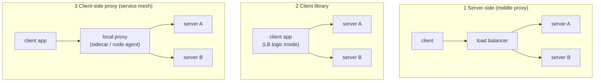
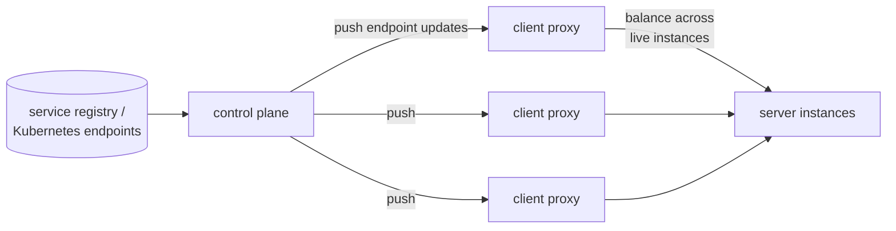

## Introduction

When most of us learn about load balancing, we picture a box in the middle:
clients on one side, servers on the other, and a dedicated balancer — an nginx,
an HAProxy, a cloud ALB — deciding where each request goes. It's a simple and
battle-tested picture. So it surprises many people to learn that inside a
modern service mesh like Istio or Linkerd, **that box doesn't exist**. There is
no load balancer between your services. Instead, every client picks the
destination server itself, on every single request.

This isn't an accident or a cost-saving trick. Client-side load balancing is
one of the foundational design decisions that makes the service mesh
architecture work at all. In this post I want to explain what it is, why the
industry converged on it, and what trade-offs come with it.

<!--truncate-->

## The Three Load Balancing Models

There are only three places a load-balancing decision can happen:

1. **Server-side (middle proxy)**: a dedicated balancer sits in the request
   path. The client only knows one address — the balancer's.
2. **Client library**: the balancing logic is compiled into the application
   (think Netflix Ribbon, or gRPC's built-in load balancing policies). The
   client knows all server addresses and picks one itself.
3. **Client-side proxy**: the same idea, but the logic lives in a small proxy
   deployed next to the application — a sidecar container or a per-node agent.
   The app talks to `localhost`; the proxy picks the destination.

A service mesh is essentially model 3 at scale: a fleet of client-side proxies
(the *data plane*) plus a *control plane* that tells every proxy which server
instances currently exist. The mesh proxy does terminate and forward traffic —
but the **balancing decision** is made at the client's edge, from the client's
own view of the world. There is no shared box in the middle.

## Why the Mesh Went Client-Side

### 1. The middle proxy is a bottleneck and a blast radius

Put a balancer between every pair of services in a microservice system and you
have created a component that:

- **adds a network hop** (and its latency) to every internal call,
- **must scale with the sum of all traffic** — it becomes the hottest, most
  over-provisioned tier in your infrastructure,
- and **fails globally**: an outage or a bad config push in the balancing tier
  can take down communication between services that have nothing to do with
  each other.

Client-side balancing dissolves this component entirely. The "balancer"
capacity scales automatically and perfectly — every new client brings its own.
A proxy failure affects exactly one client instance. There is no tier to
provision, no hotspot to monitor, no single choke point on the internal call
graph.

### 2. The client has the best signal

Here's the underappreciated part: the client's edge is the *best possible
place* to make a balancing decision, because it directly observes the only
thing that matters — **how each server is performing for this client, right
now**.

Every response teaches the local proxy something: this instance answered in
2ms, that one took 800ms, this one just returned three errors in a row. From
these observations, modern mesh proxies run algorithms a middle box struggles
to match per-client:

- **Least-pending / least-latency (P2C)**: pick two random candidates, choose
  the one with fewer in-flight requests or lower observed latency. The famous
  ["power of two choices"](https://www.eecs.harvard.edu/~michaelm/postscripts/tpds2001.pdf)
  result shows this gets you close to optimal balance *without any
  coordination between clients* — which is exactly the constraint client-side
  balancing operates under.
- **EWMA-based scoring**: exponentially weighted latency averages that adapt
  within seconds when an instance degrades.
- **Outlier detection**: an instance that keeps failing is ejected from *this
  client's* candidate list for a cooldown period — passive health checking
  derived purely from real traffic, no probes needed.

A centralized balancer sees aggregate load, but it can't see *your* connection
quality to a server, and it becomes a coordination point that every client's
fate depends on.

### 3. Per-request intelligence needs to live where the request starts

The features that make a mesh valuable — retries, canary routing, zone-aware
failover, traffic mirroring, circuit breaking — all share one property: they
are **decisions about where and whether to send a request**, informed by the
request's content and the caller's context.

Consider a retry. When a request to instance A fails, the retry should go to
instance B — *specifically not A*. Only the component that chose A can know to
exclude it. Or consider canary routing: "send 1% of requests, or requests with
this header, to v2". The subset selection and the load balancing over that
subset are one fused decision. If balancing happened in a middle box, every
routing feature would need to move into that box too, recreating the
monolithic "intelligent load balancer" appliance that microservices were
trying to escape.

Client-side balancing keeps the whole decision chain — *route → subset → pick
→ retry* — in one place, at the request's origin, where all the context is.

### 4. The control plane made it practical

Client-side balancing is an old idea, and it used to have a fatal flaw: **how
does every client learn the current set of server instances?** In the
client-library era this meant registry SDKs in every language, cache
invalidation bugs, and stale endpoint lists causing mysterious errors.

The service mesh solved this with the control plane. Components like Istio's
istiod watch the platform's source of truth (e.g. Kubernetes endpoints) and
**push** endpoint updates to every proxy within seconds over protocols like
xDS. Discovery became an infrastructure guarantee instead of an application
concern, and the historical reason to centralize balancing — "clients can't
know the backends" — simply disappeared.

### 5. The sidecar decoupled it from your code

Model 2 — the client library — already had most of these benefits. What it
didn't have was operability. The balancing logic was compiled into hundreds of
applications in five languages, and upgrading an algorithm meant a
company-wide redeploy campaign.

Moving the logic into a co-located proxy kept the client-side *decision* while
making the *implementation* independently upgradable, uniform across
languages, and owned by a platform team. That combination — client-side
placement, platform-side ownership — is arguably the core innovation of the
service mesh.

## The Honest Trade-offs

Client-side balancing is not free, and knowing the failure modes matters:

- **Stale local views.** Each proxy balances from its own observations, which
  are incomplete. Naive "pick the least loaded" on stale data causes herding —
  every client stampedes the same "idle" server. This is precisely why meshes
  use randomized algorithms like P2C instead of global argmax.
- **Low-traffic degeneration.** A client that sends one request a minute has
  no meaningful latency statistics; its choices degrade toward random. That's
  acceptable — many independent random choices aggregate evenly — but it means
  fancy algorithms only shine on busy paths.
- **No global fairness guarantee.** No single component can enforce "this
  server gets at most X QPS in total". Mature systems compensate with
  **server-side admission control**: the receiving end keeps the final veto
  through local rate limiting and overload rejection. Balancing lives with the
  client; *admission* lives with the server. The two are complementary, not
  redundant.
- **Trust.** The client picks the destination, so a buggy or malicious client
  could pick badly. Meshes answer with mTLS and server-side policy
  enforcement — and this concern is exactly why some newer designs
  (e.g. Istio's ambient mode *waypoint proxies*) move L7 policy and balancing
  back to a destination-side proxy for workloads that need it. Server-side
  balancing hasn't vanished; it has retreated to the boundaries where trust
  and ownership change hands: ingress gateways, cross-cluster gateways, and
  scale-to-zero activators.

## Takeaways

- In a service mesh, there is no load balancer between services — **every
  client's local proxy is the load balancer**, working from endpoint lists
  pushed by the control plane.
- The model wins on scalability (balancer capacity grows with clients), blast
  radius (no shared middle tier), signal quality (direct observation of each
  server's behavior), and feature velocity (retries, canaries, and failover
  are one fused client-side decision).
- Its weaknesses — stale views, no global fairness, client trust — are managed
  with randomized algorithms, server-side admission control, and
  destination-side proxies at trust boundaries.
- When you evaluate or debug a mesh, remember where the decision happens:
  if requests are skewing to one instance, the answer is in the *clients'*
  proxies — their endpoint lists, their health views, their algorithm — not in
  a middle box, because there isn't one.
