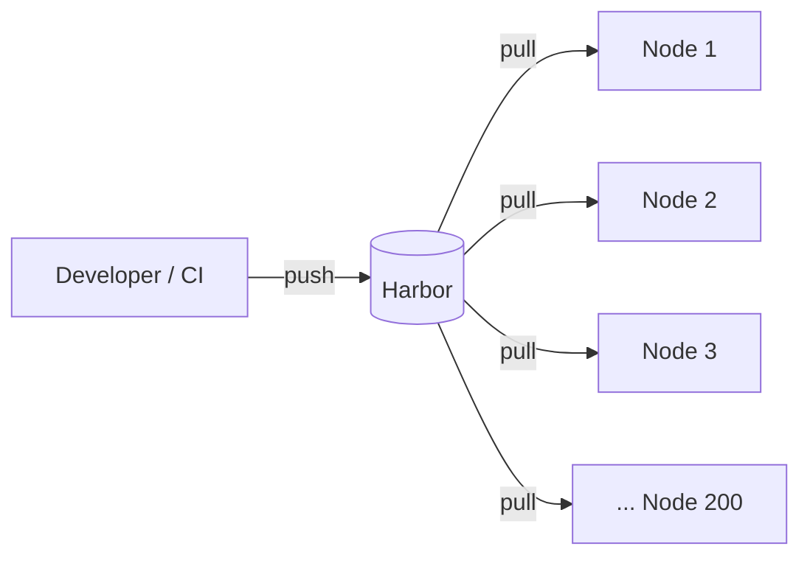
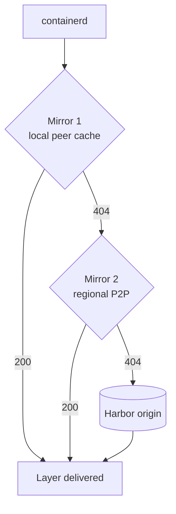
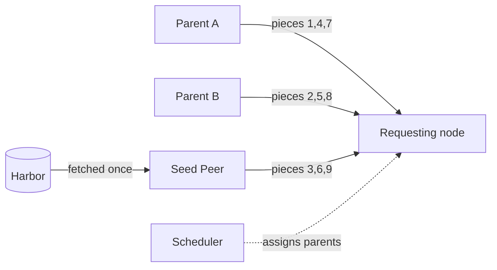
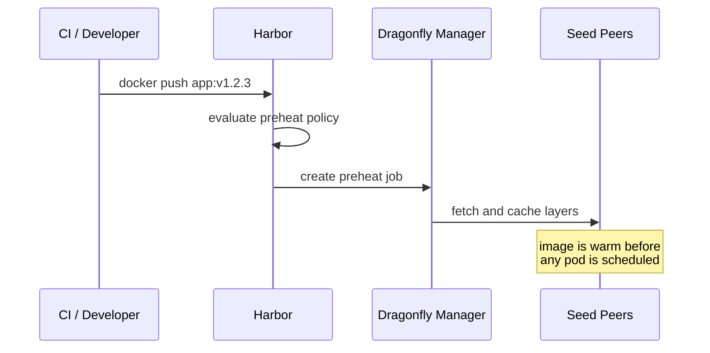
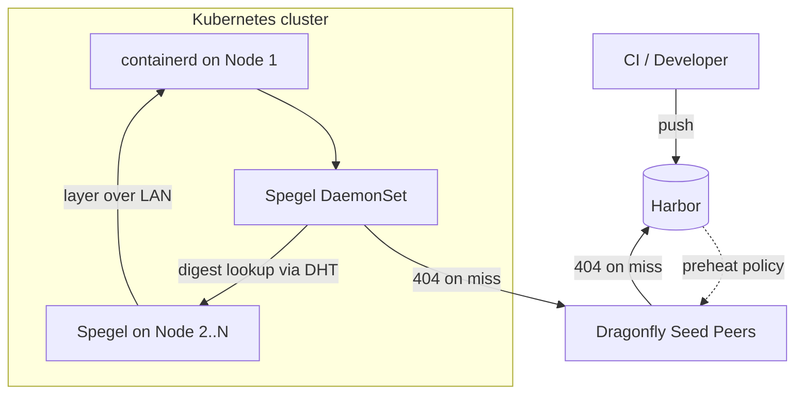

A container registry serves one image to one client at a time. A Kubernetes cluster asks it for the same image, on two hundred nodes, in the same second.

That asymmetry is the root of nearly every image distribution problem you will hit at scale. Image layers are content-addressed and immutable, so by the time the two hundredth node makes its request, the bytes it wants are already sitting on local disk on a hundred and ninety-nine of its neighbours. It goes to the registry anyway, because nothing in a stock container runtime knows those neighbours exist.

This post walks through a tiered architecture that fixes this — Harbor as the source of truth, Dragonfly for regional distribution, and Spegel for intra-cluster peer-to-peer — with attention to the part most write-ups skip: the containerd mechanism that makes tiering work at all, and where the design still has sharp edges.

<!-- truncate -->

## 1. The Baseline and Its Ceiling

Most teams start by moving off public registries onto something self-hosted. Harbor is the usual destination, and for good reason: role-based access control, vulnerability scanning, image signing, replication, retention policy. It is a genuinely good place to keep images.

What it cannot do is defy arithmetic.



Harbor uses a traditional client-server model. A rolling update across two hundred nodes means two hundred TLS handshakes, two hundred authorization checks, and two hundred copies of identical layers crossing the network. What you observe on the other side is some combination of:

- CPU saturation on the Harbor core instances
- Multi-gigabit egress, often across a WAN link you are paying for by the byte
- Registry rate limiting, which surfaces as `429` or `403` responses mid-pull
- Container runtime timeouts, which surface as pods stuck in `ImagePullBackOff`

The failure is rarely graceful. A registry under pull pressure tends to degrade for *everyone*, including the CI pipeline trying to push the fix.

The fix is not a bigger registry. It is to stop asking the registry for bytes that already exist closer to the node.

## 2. The Mechanism: How containerd Chains Mirrors

Before introducing any tool, it is worth understanding the mechanism everything else depends on — because it lives in containerd, not in any of the tools we are about to add.

containerd supports a per-registry host configuration. First, point it at a configuration directory in `/etc/containerd/config.toml`:

```toml
version = 2

[plugins."io.containerd.grpc.v1.cri".registry]
  config_path = "/etc/containerd/certs.d"
```

Then, for each registry you want to accelerate, write a `hosts.toml`:

```toml
# /etc/containerd/certs.d/harbor.example.com/hosts.toml

server = 'https://harbor.example.com'          # the origin, tried last

[host.'http://127.0.0.1:29999']                # tried first
capabilities = ['pull', 'resolve']

[host.'http://dragonfly-proxy.infra:65001']    # tried second
capabilities = ['pull', 'resolve']
```

Three properties of this configuration carry the entire architecture:

1. **containerd tries each `[host.…]` entry in the order written**, and only falls through to `server` when every one of them has declined.
2. **A mirror declines by returning `404`.** It does not error, and it does not proxy upstream on your behalf. It says "not me" and gets out of the way.
3. **No mirror needs to know about any other mirror.** They are entries in a list. The ordering is the only coupling between them.

That third property is what makes this composable. Spegel has no configuration naming Dragonfly. Dragonfly has no idea Spegel exists. Either can be removed by deleting one line, and the rest keeps working.



Keep this diagram in mind. Every tier we add is one more box on the left of that chain, and every tier's contract is identical: **serve a 200, or decline fast.** A tier that hangs instead of declining is worse than no tier at all, because it delays every pull it cannot serve.

## 3. The Mid-Mile: Harbor + Dragonfly

[Dragonfly](https://github.com/dragonflyoss/dragonfly) is a CNCF Graduated project for P2P data distribution. It graduated in October 2025 after five years in incubation, and it is the heavyweight in this stack.

It runs four component types:

| Component | Responsibility |
| --- | --- |
| **Manager** | Cluster configuration, the preheat API, and the web console |
| **Scheduler** | Decides which peers serve which pieces to a downloading client |
| **Seed Peer** | A root node with upload and download capability — the designated first-hop cache in front of the registry |
| **Peer / Client** | The per-node daemon that a container runtime talks to, over HTTP proxy or gRPC |

### Piece-Based Distribution

The important design decision is granularity. Dragonfly does not move whole blobs between peers — it splits content into **pieces** and lets a client assemble one file from several parents concurrently.



This matters for two reasons. A slow or failing parent costs you one piece rather than the whole transfer. And piece completion metadata flows back to the scheduler, so subsequent requests get routed by what is genuinely cached rather than by what was cached when the job started.

### Preheat: Getting Ahead of Demand

Everything described so far is reactive — content lands on the P2P network as a side effect of someone pulling it. Dragonfly is the one component in this stack that can also act *before* demand exists.

Harbor integrates with this natively through its **P2P Preheat** feature. Register a Dragonfly instance as a distribution provider, attach a policy to a project, and Harbor calls the Dragonfly Manager whenever a matching image is pushed.



Worth knowing: **preheat scope is configurable**, and the default is narrower than what is often useful. You can target a single seed peer, all seed peers (the default), or **all peers in the cluster** — the last optionally narrowed by IP, count, or percentage. If your goal is "the layers should already be on the nodes," that last option is the one you want, and it is easy to miss.

## 4. The Last-Mile: Adding Spegel

Dragonfly solves regional distribution well, but running a full Dragonfly peer on every Kubernetes worker adds real operational surface: a daemon with local storage to size, manage, and garbage collect.

[Spegel](https://github.com/spegel-org/spegel) takes the opposite approach for the intra-cluster hop. It is a stateless registry mirror that runs as a DaemonSet and **reuses containerd's existing content store** rather than maintaining a cache of its own. No database, no persistent volume, no second copy of your layers.

Its operating loop is simple:

- Watch containerd for image events, and advertise the layer digests this node holds
- When the local containerd asks for a layer, look up which peers hold it
- Proxy the bytes from a peer that does, over the cluster network
- Return `404` if nobody does, so containerd moves to the next mirror

Peer discovery runs over **libp2p using a Kademlia distributed hash table** — there is no central coordinator, which is exactly what keeps Spegel stateless. Remember this detail; section 6 is largely about its consequences.

### The Assembled Pipeline



A developer deploys a manifest referencing `harbor.example.com/team/app:v1.2.3`. They never learn that either tool exists. Underneath:

1. containerd asks Spegel on loopback.
2. Spegel queries the DHT for the layer digest. If a peer has it, the bytes move node-to-node over the LAN and the pull never leaves the cluster.
3. If no peer has it, Spegel returns `404` and containerd tries the next mirror — Dragonfly.
4. Dragonfly serves from its seed peers, which are already warm because Harbor preheated them at push time. The pull resolves regionally instead of crossing the WAN.
5. Once that first node has the layer, Spegel advertises it, and every subsequent node in the cluster gets it over the LAN.

### The Configuration Detail That Is Easy to Get Wrong

Step 4 above only works if **Dragonfly is actually on the pull path.** This is the single most common mistake in this architecture: teams enable Harbor preheat, see layers land on seed peers, and assume nodes will somehow use them.

They will not. Preheating content that nothing is configured to query buys you nothing. A Spegel miss falls through to whatever the *next* `hosts.toml` entry says, and if there is no Dragonfly entry, that is `server` — Harbor, across the WAN, exactly the traffic you were trying to eliminate.

You need one of these, and you should decide which deliberately:

- **A Dragonfly peer daemon on each node**, listed as the second mirror. Best performance, since the node participates in the P2P swarm directly — but it reintroduces the per-node footprint you were avoiding.
- **A shared Dragonfly proxy endpoint**, listed as the second mirror. No per-node daemon, so the low-footprint property survives, at the cost of a network hop and a component to keep highly available.

Both are legitimate. Silently having neither is not, and it is the default outcome if you configure preheat without touching `hosts.toml`.

## 5. Where Spegel Struggles

Spegel is a well-built tool and the statelessness is a genuine feature, not a compromise. But its discovery mechanism has properties worth understanding before you depend on it, and they all trace back to the same design decision: a distributed hash table.

**Discovery latency is unbounded in principle.** A Kademlia lookup traverses multiple hops across the network. Most complete quickly; the tail does not, and that tail is on the critical path of every cache miss. Worse, a *lookup that fails slowly* is strictly worse than no cache at all — you have paid latency and still have to pull from origin.

**Lookups are probabilistic, not authoritative.** Kademlia offers no guarantee that a key present in the network will be found. A miss is indistinguishable from an absence. The practical effect is a hit rate below what the physical distribution of your bytes would allow: the layer was on the next rack the whole time, and the lookup simply did not find it.

**Deletions do not propagate.** When a node's kubelet garbage-collects an image, that fact does not reach the DHT. The stale record is cleaned up only when some other node tries the dead holder and receives a `404`. The index accumulates inaccuracies, and every one of them costs a failed request before it is corrected. On clusters with aggressive image GC — which is to say, any cluster running large images — this is not a rare edge case.

**It only helps within one cluster.** Spegel's scope is the cluster it runs in. A fleet of many small clusters gets far less from it than one large cluster does, because the population of potential peers is what makes it work.

**Cold start is unavoidable.** The first pull of any new image has no peer to serve it, by definition. If your workload is dominated by images used once — CI jobs, ephemeral environments, per-experiment builds — most of your pulls are cold and the peer layer rarely engages.

None of this makes Spegel a bad choice. It makes it a *reactive, best-effort* layer, and problems begin when it is treated as a guaranteed one.

## 6. Making It Better

Most of the improvements available here are configuration rather than code.

**Fail fast on discovery.** Tune Spegel's resolve timeout aggressively downward. The goal is not to maximise hit rate — it is to minimise the cost of a miss. A tight timeout that falls through to a warm Dragonfly tier beats a generous one that eventually finds a peer. This is the single highest-leverage knob in the stack, and the correct value depends on how fast your next tier is.

**Order the chain by cost, and make every tier cheap to skip.** The chain is only as good as its worst decline. Verify each mirror returns `404` promptly on a miss rather than hanging or 500-ing.

**Preheat to all peers, not just seed peers, for images you know are coming.** This directly addresses the cold-start problem and the DHT's discovery unreliability at once — if the layer is already on the node, no lookup is needed. Reserve it for genuinely hot images; preheating everything to everywhere is just an expensive way to fill disks.

**Make your tags immutable.** This is a correctness issue, not an optimisation. Content caching is only safe when a reference always means the same bytes. Repush under an existing tag and your P2P layer will confidently serve the old image to anyone whose lookup hits a node holding it. Enable tag immutability in Harbor, or pin by digest in your manifests. Do this before you enable caching, not after you get a confusing bug report.

**Use `imagePullPolicy: IfNotPresent`.** `Always` forces a registry round trip for manifest resolution on every pod creation, even when every layer is already local. Layers are not re-downloaded, so the cost is a round trip rather than a full pull — but it is paid per creation and it puts your registry back on the critical path for a pull the cache could have served entirely. Immutable tags are the precondition that makes this switch safe.

**Give your scheduler a reason to reuse warm nodes.** A per-node cache only pays off when pods land on nodes that already hold the layers. Soft node affinity toward a workload-specific node pool converts a scattered set of cold pulls into one cold pull and many warm ones.

**Measure the hit rate.** Both Spegel and Dragonfly export Prometheus metrics. If you cannot see what fraction of pulls are served locally, from a peer, from the region, and from origin, you cannot tell whether any of the above helped. Build that dashboard before you start tuning.

**If DHT discovery is your bottleneck, consider replacing it.** This is a larger step, but worth naming: the tradeoff Spegel makes — no central component, therefore no authoritative index — is a choice, not a law. A centralized index that tracks which nodes hold which digests gives you single-hop, authoritative lookups and lets you reconcile deletions explicitly instead of discovering them through failures. You give up statelessness and take on a service and a datastore to operate. For large clusters where the miss rate is measurably costing you, that trade can be clearly worth it.

## 7. Honest Limits

It is worth being clear about what a tiered P2P stack does not do.

| Problem | Does this stack help? |
| --- | --- |
| Same image, many nodes, at once | **Yes** — this is the core case |
| Registry slow or down, image already in cluster | **Yes** — pulls resolve from peers |
| Registry down, image never pulled | **No** — nothing has the bytes |
| First pull of a brand new image | Partially — preheat helps, otherwise cold |
| Large image where most layers are never read | **No** — the full image still transfers |
| Getting bytes onto nodes before demand | Only via Dragonfly preheat |

The last two rows point at a different axis entirely. This architecture makes the same bytes cheaper to move; it does not make *fewer* bytes move. If your images are large because they carry model weights or deep dependency trees that a given workload barely touches, the bigger win may be a lazy-loading image format — [Nydus](https://github.com/dragonflyoss/nydus) or [eStargz](https://github.com/containerd/stargz-snapshotter) — which fetches only the chunks actually read. Dragonfly integrates with Nydus for exactly this reason, and the two compose well.

Two more things that P2P does not exempt you from. **Authentication still happens on every pull** — these layers move bytes, not entitlements, so credentials must still be configured on the node, and a broken auth path through a mirror will look confusingly like a cache problem. And **registry availability still matters**, because P2P raises the floor for content the cluster has already seen, which is most content most of the time, but never all of it.

## Conclusion

The useful idea here is not any individual tool — it is the separation of concerns. Dragonfly owns proactive, regional, heavyweight distribution. Spegel owns reactive, intra-cluster, zero-footprint mirroring. Harbor stays the single source of truth and never learns that either exists. Each tier is one line in a `hosts.toml`, and any of them can be removed without touching the others.

Get the containerd mirror chain right first, because nothing else works without it. Make your tags immutable before you cache anything. Then add tiers one at a time and measure each, because a cache you cannot observe is a cache you cannot trust.
