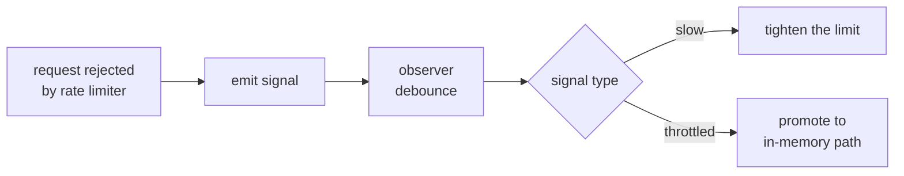
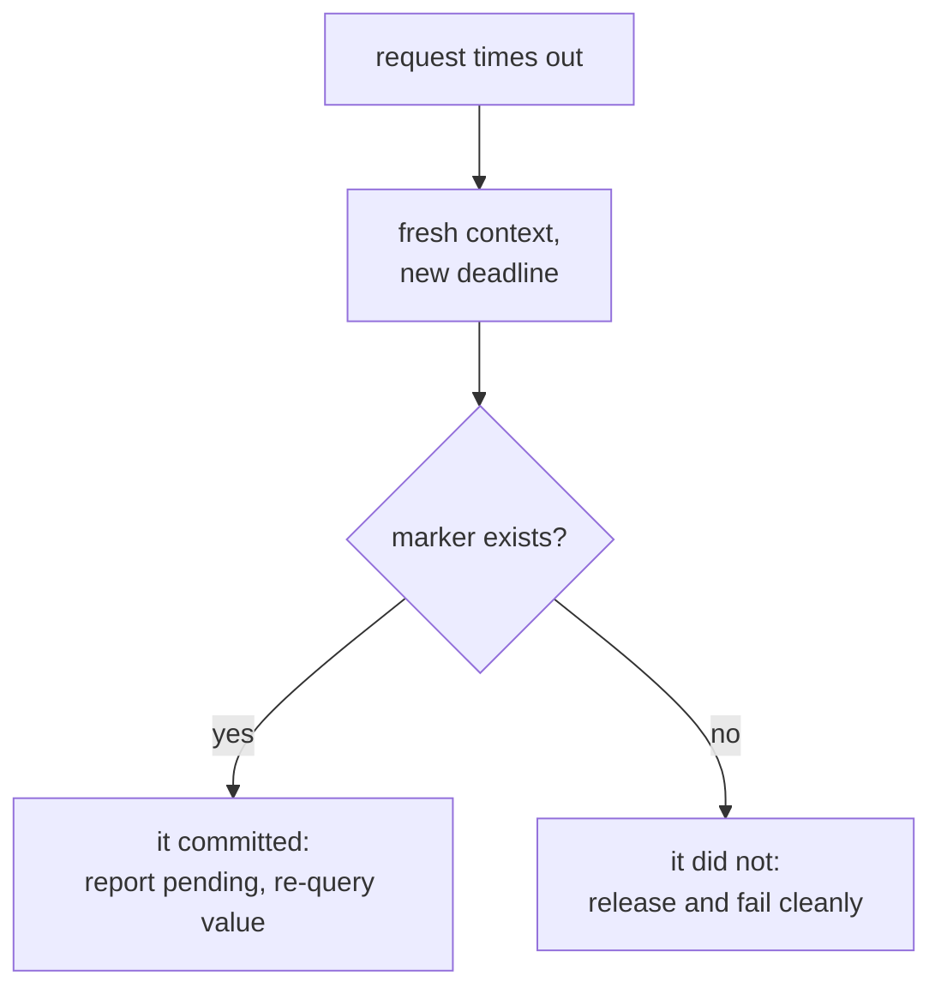
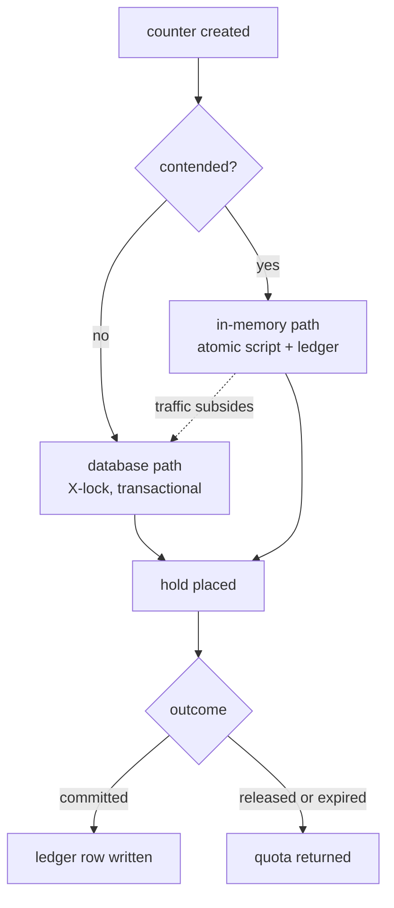

A lot of systems reduce to the same primitive: **a number that many clients
decrement concurrently, and that must never go below zero.**

- Tickets left for a concert
- Units left in a flash sale
- API credits left on a plan this month
- Budget left on an ad campaign
- Seats left on a software licence
- Slots left in a booking calendar

Different products, one problem. Most engineers would sketch the solution in a
minute: a row in a table, an `UPDATE`, done. That sketch is correct, and it works
right up until a few thousand clients converge on the same number in the same
second — at which point every assumption in it fails at once.

This post is about that counter: why it is harder than it looks, what the correct
simple solution is, where it stops scaling, and what to replace it with.

## What makes a counter hard

Three properties, each adding difficulty:

- **Contended** — many clients want the same number at the same time. Load is not
  spread across keys; it converges on one.
- **Floored** — you cannot hand out what you do not have. Zero is a hard boundary,
  and crossing it is not a rounding error.
- **Consequential** — being wrong costs something real: refunds, oversold seats,
  a customer billed for capacity you cannot deliver, manual cleanup.

Remove any one and the problem becomes easy. A contended counter with no floor is
just a metric — let it drift. A floored counter with no contention is a plain
transaction. It is the combination that forces everything below.

## The asymmetry that drives every decision

There are two ways to be wrong, and they are **not** equally bad:

| Failure | What happens | Recoverable? |
| --- | --- | --- |
| **Over-allocate** | You hand out more than exists | Badly. Retract commitments, refund, apologise, clean up by hand |
| **Under-allocate** | You refuse a request you could have served | Yes. Lost value on those attempts, nothing broken |

Under-allocating costs money once. Over-allocating costs money, trust, and
operational time — and often cannot be undone at all once the client has acted on
the response.

Internalise this early, because it resolves most design arguments that follow:
**when forced to choose, fail toward under-allocating** — deliberately,
predictably, and in a way you can alert on.

With one caveat worth stating plainly: **how bad over-allocation actually is
depends on the domain, and it is worth measuring rather than assuming.** Handing
out a concert seat that does not exist is unrecoverable. Overspending an ad budget
by 0.1%, or letting a few extra API calls through before a soft limit bites, costs
almost nothing. Where over-allocation is genuinely cheap, an approximate approach
with periodic reconciliation is the *correct* answer rather than a compromise — and
several of the techniques below become much more attractive. Decide which kind of
quota you have before you design for it.

## The correct starting point: let the database do it

Before reaching for anything clever, be clear about what already works. The whole
operation fits in one statement:

```sql
UPDATE quota SET remaining = remaining - ?
 WHERE id = ? AND remaining >= ?;
-- affected rows = 1 → granted
-- affected rows = 0 → insufficient
```

The database takes an exclusive row lock (an X-lock) for the duration of that
statement, so the check and the decrement are indivisible. Two clients racing for
the last unit are serialised — one wins, the other matches zero rows and is
refused. The `remaining >= ?` predicate is the floor, enforced by the engine
rather than by your code.

This is not a naive solution. It is correct, durable, trivial to reason about, and
it composes with everything else in the same transaction. **The overwhelming
majority of counters in the overwhelming majority of systems should be exactly
this and nothing more.**

### When you need more than one statement

Sometimes the decision requires application logic that cannot fit in a predicate —
consulting another service, or applying rules that depend on the current value. Then
you take the lock explicitly and hold it:

```sql
BEGIN;
  SELECT remaining FROM quota WHERE id = ? FOR UPDATE;   -- explicit X-lock
  -- application decides
  UPDATE quota SET remaining = remaining - ? WHERE id = ?;
COMMIT;
```

Same guarantee, but note what changed: **the lock is now held across an application
round trip.** That matters more than it looks, because throughput on a single row is
bounded by how fast you can serialise:

```
max throughput ≈ 1 / (lock hold time)
```

A single statement holds the row for a few hundred microseconds. The explicit
version holds it for however long your application takes to decide — commonly 2 ms
or more once a network hop is involved. That is the difference between roughly 5,000
and roughly 500 operations per second **on the same hardware**, so keeping logic out
of the critical section is often the cheapest optimisation available.

Either way the row is the serialisation point, and no amount of additional
application servers or read replicas changes that ceiling.

One property worth not giving up too early: **related state moves atomically with
the counter.** A record of who took the quota, an audit row, a status change — all
committed together or not at all. Every technique later in this post erodes that
guarantee to some degree.

## A quota is rarely a single number

Before scaling anything, model it correctly. Most real quotas have at least two
states, because commitment is not instantaneous:

- **Total** — what exists.
- **Held** — claimed by an in-flight operation that has not finished.
- **Committed** — permanently consumed.

A seat held while someone enters payment details is neither free nor sold. An API
call in flight has consumed budget that is not yet billed.

What a new request can actually take is roughly:

```
available = max(0, total - committed - max(0, held))
```

The inner clamp is not defensive noise. Held counts can legitimately go negative
during correction flows — an over-release, a reversal applied twice — and without
the clamp a negative hold silently **inflates** availability. That is an
over-allocation bug hiding inside an arithmetic simplification.

Holds need their own records, and it pays to store both the **current** held
amount and the **original** held amount. When something goes wrong weeks later —
and it will — the original value is what lets you reconstruct what should have
happened. Repair tooling is impossible without a baseline to repair toward.

Releasing a hold is just the reverse operation under the same X-lock. Holds that
are never released are the most common leak in these systems, so give them an
expiry and run a background sweeper that reclaims expired ones. Without a sweeper,
every crashed client permanently strands quota.

## Linked and nested quotas

Rarely is there just one counter. Common shapes:

**Independent sub-quota.** A slice is carved out up front and tracked separately —
a campaign gets 200 units off a pool of 1000, leaving 800 for everyone else. Two
counters that never interact. Simple and safe. The cost is stranded capacity: if
the campaign under-uses its slice, nobody else could have it.

**Shared pool.** The campaign draws from the same pool as everyone else, with its
own cap on how much it may take. Nothing is stranded. The cost is that a single
request must now decrement **two** counters — the campaign cap and the shared
pool — and both must hold.

```
Independent sub-quota:            Shared pool:

  general:   [ 800 ]                shared pool: [ 1000 ]
  campaign:  [ 200 ]                campaign cap:[  200 ]
  (never interact)                  (one request decrements BOTH)
```

The shared-pool shape is where over-allocation bugs breed. If the two decrements
are not atomic, concurrent requests can pass the cap check while the pool
underflows, or the reverse. **Both counters must be validated and written as one
indivisible step, or the model is unsafe.**

With the database approach this is nearly free: lock both rows in the same
transaction, in a **consistent order** across all code paths to avoid deadlock.
Once the counter moves out of the database, preserving this property takes real
care — which is most of the next section.

## The wall: one row cannot absorb a spike

Here is where the simple solution runs out.

Ten thousand concurrent decrements of one row means ten thousand transactions
queueing on one lock. Latency climbs, connections pile up waiting, timeouts
cascade — and then the database starts struggling on *unrelated* queries, because
the connection pool is exhausted by clients blocked on that single row.

That last part is what makes it dangerous. A hotspot on one key degrades the whole
database, not just the hot key.

You cannot tune your way out. Faster disks, more replicas, bigger instances — none
of them change the fact that the row is a serialisation point. The only fix is to
change how requests reach it.

## The ways out

There is more than one, and they attack different parts of the problem. Worth
seeing the whole space before committing to any of it:

| Strategy | Idea |
| --- | --- |
| **Make the counter faster** | Keep one authority, move it somewhere that serialises quickly |
| **Reduce writes that reach it** | Batch them, hand out blocks in advance, or admit fewer clients |
| **Split it** | Several sub-counters instead of one |
| **Eliminate it** | Materialise the units as rows and claim them |
| **Serialise instead of lock** | One writer owns the key, everyone else queues |

### Admission control — don't let the load arrive

The most effective option is often the least technical. A waiting room or virtual
queue at the edge admits a fixed number of clients per second into the flow that
touches the counter. Everyone else sees a queue position.

This does not make the counter faster. It makes the counter's problem *small enough
that the plain single-statement `UPDATE` is sufficient*. Serving 500 requests per
second from one row is easy; the difficulty was the 50,000 that never needed to
reach it. If a queue is acceptable in your product — and for ticket sales and drop
launches it is expected — try this before anything else here.

### Batching — coalesce before you write

Keep the central counter, but collect concurrent requests in-process for a few
milliseconds, apply one combined decrement in a single transaction, then distribute
the individual answers back to the waiters.

Lock acquisitions drop by the batch factor while the semantics stay synchronous and
exact — clients simply wait a few milliseconds longer. It composes with everything
else and is badly underused relative to how well it works. The complexity lives in
partial fills: when 47 are requested and 30 remain, you need a fair, deterministic
rule for who gets served.

### Leases — hand out blocks in advance

Each instance checks out a block of quota from the central counter, then serves
requests locally with no network call at all.

```
central: 1000
  instance A leases 50  →  serves 50 requests with zero contention
  instance B leases 50  →  ...

central touched once per 50 requests → contention drops 50×
```

This is the *escrow* method from the transaction-processing literature, and the same
shape as batched ID generation and most distributed rate limiters. Its great virtue
is that it **removes the hot-key problem rather than managing it** — no detection, no
promotion, no cutover, and throughput scales linearly with instance count.

The costs are real. A crashed instance strands its unreturned block until the lease
expires, so leases need a TTL and a reclaim path. And it fragments at the tail: ten
instances each holding five units with three actually left means refusing requests
while quota exists. The standard mitigation is adaptive lease sizing — large blocks
while plentiful, shrinking toward one as you approach zero.

### Sharded counters — split the row

Divide 1000 into ten buckets of 100 and hash each request to a bucket. Contention
drops tenfold for a very small change.

The tail behaviour is the problem. Bucket three empties while bucket seven still
holds fifty, so you begin refusing at perhaps 70% consumed unless you implement
stealing between buckets — and stealing reintroduces cross-bucket contention exactly
when contention is worst. Reasonable when "sold out slightly early" is acceptable,
poor when the last units matter.

### Materialised slots — remove the counter entirely

Instead of decrementing a number, create one row per unit up front and let clients
claim rows:

```sql
UPDATE slots SET owner = ?, claimed_at = now()
 WHERE quota_id = ? AND owner IS NULL
 LIMIT 1;
```

Claims land on *different* rows, so there is no single hot row to queue behind. More
importantly, over-allocation becomes **impossible by construction** — there is no
arithmetic to get wrong, and uniqueness is enforced by the schema rather than by your
code. Databases that support skipping locked rows during selection make claiming
effectively contention-free.

This fits naturally when units are individually identified anyway: numbered seats,
licence keys, specific appointment times. The limit is scale — a million-unit quota
means a million rows, and the contention reappears as index hot-spotting.

### Single writer — serialise instead of locking

Route every mutation for a key through a partitioned log, with one consumer owning
that counter in memory. There are no locks because there is only one writer.

Throughput is excellent and ordering comes free. The catch is that it changes the API
contract from synchronous to asynchronous: the client is told "queued", not "granted".
That is fine where a waiting room is expected and unacceptable in a checkout call that
must answer immediately. Partition rebalancing also means handing off counter
ownership, which needs care.

### Two that look appealing and usually are not

**Optimistic concurrency** — a version column with retry on conflict — is what many
people try first. Under *extreme* contention it is worse than locking: conflict rates
approach 100%, retries amplify the load that caused them, and throughput can collapse.
Good at low to moderate contention, actively harmful at the scale this post is about.

**Conflict-free replicated counters with bounds** can enforce a floor across regions
that cannot coordinate synchronously, essentially by distributing escrow rights per
replica. The right tool if you genuinely need geo-distributed enforcement, and heavy
machinery if you do not.

### The lens that ties them together

Every technique that reduces contention does it by **distributing knowledge of the
remaining amount** — and they all degrade in the same place:

> Batching, leases, and sharding work beautifully while quota is plentiful, and all
> lose precision as it approaches zero — which is exactly when precision matters most.

Hence the pattern most mature systems converge on: **an approximate, cheap strategy
while plentiful, falling back to the exact centralised path near zero.** Leases that
shrink to one unit; sharding that collapses to a single locked row below a threshold.

The rest of this post follows one route in depth — moving the counter into an
in-memory store — because it is the most involved and the one with the most ways to
get subtly wrong. Much of what it covers (fail-closed on missing state, resolving
ambiguous timeouts, crossing between a fast and an exact path) applies to the others
too.

## Moving the counter to an in-memory store

Relocate the contended counter into an in-memory data store (Redis being the usual
choice), where a single-threaded server processes the same operations orders of
magnitude faster, with no disk commit in the path.

But a "read, subtract, write" from application code is a lost update waiting to
happen. You have removed the lock without replacing what it guaranteed. The
read-check-write must execute **inside** the store as one indivisible unit — which
is what server-side scripting is for.

A useful mental model of what the script must do:

```
1. read the counter
2. if it does not exist            -> error, do not create it
3. compute the new value
4. if it would go below zero       -> return the shortfall, WRITE NOTHING
5. write the new value, refresh its expiry
6. write a marker recording this operation
7. return the new value
```

Several steps are less obvious than they look.

### Step 2 — never invent state

The instinctive implementation uses the store's built-in decrement command.
Resist it.

Built-in increment and decrement operations **create the key if it is absent**,
treating "missing" as zero. In this design a missing counter means the store lost
data — and inventing a counter from nothing converts a cache outage into unlimited
over-allocation. An explicit read lets you distinguish "empty" from "gone" and
reject the second.

### Step 4 — validate everything before writing anything

With a built-in decrement you apply first and discover the problem afterwards,
which means compensating writes. For the shared-pool shape that means several
compensating writes, any of which can fail — you have reinvented distributed
rollback inside what should be one operation.

Reading and computing first gives you a **dry run**: check every counter, and
commit only once all of them pass. This is exactly what makes linked quotas safe.
The script becomes all-or-nothing across the cap, the pool, and any per-segment
counters, with the same guarantee the database transaction gave you.

It also lets step 4 return the **shortfall** without writing — the caller learns
not just that it failed but by how much, which is useful for monitoring and for
offering a smaller amount.

### Step 5 — write with an expiry

Writing the value and refreshing its expiry in one command means active counters
stay resident and idle ones age out naturally. A separate expiry command would be
a second round trip and a second failure point.

### Step 6 — the marker earns its keep later

More on this shortly; it is what makes timeouts answerable.

### One infrastructure caveat

In a clustered in-memory store, a script may only touch keys living on the same
node. Since one request may update a cap, a pool, and per-segment counters
together, all keys belonging to one logical quota must be **deliberately
co-located** — most stores support this through a key-naming convention that pins
related keys to the same shard.

Get this wrong and nothing breaks in development on a single node. It breaks in
production, under load, as scripts failing on cross-node access.

## Deciding which counters get the fast path

Running everything through the in-memory path would be wasteful and would make
that store a single point of failure for the entire system. Only a tiny fraction
of counters are ever contended — but *which* ones is usually not knowable in
advance. Plans change, a link goes viral, one customer's integration starts
looping.

### Let the system detect contention itself

The elegant approach reuses something you already need. Per-key rate limiting
exists anyway, to stop one key consuming the whole service's capacity. That
limiter is also a perfect **contention detector**: a key being throttled is, by
definition, a key too hot for the normal path.



Two signals, two different responses:

- **Rising latency** — struggling but not yet saturated. Response: *tighten* the
  limit and protect everything else.
- **Active throttling** — clients are being rejected. Response: **promote** the key
  to the in-memory path, then *raise* its limit, because the new path can absorb
  the traffic.

Practical points that matter:

**Debounce hard.** A contended key emits a rejection signal on every throttled
request — thousands per second. Without collapsing that into a single decision you
have replaced one hotspot with another.

**Check eligibility before promoting.** Not every counter is safe to move. Anything
with an unusual structure, a scheduled change, or an in-flight migration should be
refused. Keeping a difficult counter on the slower, simpler path is far better than
running it through machinery that does not fully handle it.

**Promote linked counters together.** If a cap and a pool move as a pair, promoting
one without the other breaks the invariant that both decrement atomically.

**Take a lock while promoting.** Several rejection signals arrive at once; without
mutual exclusion, several workers will try to seed the store simultaneously and can
write conflicting starting values.

**Seed under the database X-lock**, inside the same transaction that marks the
counter as promoted. The value copied out and the flag saying "this is now
in-memory" must agree.

**Accept the opening window.** Detection is reactive, so the first clients into the
spike are rejected while promotion happens. That is a deliberate trade: a few
seconds of refusals in exchange for never over-allocating. Whether it is acceptable
is a product decision, and it is better made explicitly than discovered later.

## The store is now authoritative. What if it dies?

Once promoted, the database row is a stale snapshot from promotion time. This is
the uncomfortable consequence of the whole design and has to be confronted.

**Do not fall back to the database on a miss.** It is the instinctive reaction and
it is exactly wrong. The database holds the pre-promotion value; serving from it
would re-hand-out everything consumed since. A missing counter must be a **hard
error that refuses the request**. The counter becomes temporarily unavailable —
under-allocation, the recoverable failure — rather than massively over-allocated.

**Keep the durable record in the database anyway.** The in-memory store should hold
*no unique state*:

| Durable (database) | Ephemeral (in-memory store) |
| --- | --- |
| A ledger row for every committed change | The live counter |
| Hold records and their status | Operation markers |
| Which counters are currently promoted | |
| The pre-promotion baseline | |

Every committed change writes a ledger row **in the same database transaction that
records the operation**. That single detail makes the counter reconstructible:
baseline plus replayed ledger equals current value. A background worker drains that
ledger into the main row continuously, so the database is always converging on the
truth rather than waiting for one big reconciliation at the end.

### The timeout problem: did my write land?

A client times out waiting for the store. The operation may have succeeded or not.
Retrying risks double-decrementing; not retrying risks losing the work. The error
itself tells you nothing.

This is why the script writes an **operation marker in the same atomic step as the
counter update**. Because both happen inside one script, they cannot disagree. The
unanswerable question *"did my write land?"* becomes the trivial question *"does
the marker exist?"* — one read.



Two details that are easy to get wrong:

- **Verify with a fresh deadline.** The original request context has already
  expired — that is *why* you timed out. Reusing it guarantees the verification
  times out too.
- **Verify on any error, not just timeouts.** A connection reset is equally
  ambiguous. Narrowing the check to timeouts leaves the same hole open.

When the marker confirms the write landed, the honest response is "this succeeded,
but I cannot tell you the resulting value — re-query." A partial answer that is
true beats a complete answer that is guessed.

## Returning to the slow path

Spikes end. The counter should go back to the database so the in-memory store is
not holding state indefinitely.

The surprising part: **a well-designed demotion moves no data at all.**

Because the ledger has been draining continuously, by the time demotion happens the
database should already match. Demotion is a cutover, not a migration — and the
check beforehand is not really a consistency check, it is a **"has the background
sync caught up?"** check.

```
promotion:   database ──copy──► store             (data moves)
while hot:   store ──ledger──► sync ──► database  (database stays current)
demotion:    verify they agree, then flip         (no data moves)
```

Demotion should refuse by default and require evidence:

1. **Is it still busy?** Recent traffic must be below a threshold. Crucially, this
   threshold should differ from the promotion threshold — that gap is the
   hysteresis that stops a counter oscillating between paths.
2. **Do the two sides agree?** Compare against the database value; any mismatch
   blocks the cutover.
3. **If they disagree, is it within tolerance?** A bounded, direction-aware
   allowance. A store value *lower* than the database usually means a small amount
   is still held somewhere and is safe to absorb; the opposite direction may mean
   the database was changed by another path and needs a human.

Then, in one transaction: clear the promoted flag first, so new traffic routes to
the database, and delete the in-memory counters second. Keep an emergency override
that skips the checks — when something is badly wrong at 3am you need a way out
that does not require the system to agree with you.

### The transition race

A request reads "this counter is promoted", and demotion completes before the
request reaches the store. The counter is gone, the request fails — even though
the database has plenty available.

Two defensible responses, worth choosing consciously:

- **Prevent it** — have the request re-check the routing decision under the X-lock
  at write time, and retry on the other path if it changed.
- **Tolerate and detect it** — let it fail closed, and alert when a request that
  started on one path finished on the other.

Most systems land on the second, because the traffic threshold means demotion
usually happens when almost nobody is active. That reasoning is sound — but note it
only holds in the *demotion* direction. **Promotion fires precisely when traffic
peaks**, so the same race in reverse carries far more traffic, and its failure
direction is over-allocation rather than under-allocation. If you harden only one
transition, harden that one.

## Drift is not a bug, it is a budget

Every technique above buys throughput by giving up synchronous consistency: a
counter in one place and a ledger draining to another, holds reclaimed by a
background sweeper, cutovers between two paths.

Drift *will* occur. The mature position is not to pretend otherwise but to manage
it as a budget:

**Make every change auditable.** Every mutation emits a record of what changed, by
how much, and why, streamed somewhere queryable. When a customer asks why their
balance is 3 instead of 5, the answer must be reconstructible — and this is also
how you distinguish a real bug from correct behaviour that merely looks odd.

**Name your edge cases.** Rather than a generic warning, give each known anomalous
state its own identifier and alert. That converts "something odd happened" into
"this specific known condition occurred, here is the runbook."

**Compare continuously, not only at cutover.** Sampled background jobs that read
both sides and report differences will find problems long before a customer does.

**Ship repair tooling alongside features.** In a system with this much asynchrony
some states will need fixing. Tools to recompute a total, replay a ledger, or
rebuild a hold from its baseline are not an admission of failure — they are
load-bearing infrastructure. Write them early.

**Write down what you accept.** Some inconsistency is not worth eliminating.
Documenting "in this scenario the two sides can differ by N, and here is why that
is acceptable" is far better engineering than silently hoping it never happens. An
undocumented tolerance eventually becomes an incident nobody understands.

And two rollout practices that matter more here than elsewhere: put **everything
behind a runtime switch** — allowlists, percentage rollouts, per-tenant toggles —
because when something misbehaves mid-spike you need seconds, not a release cycle.
And **test with real load on separate data**: a shadow path with mirrored tables
and prefixed keys, selected by one flag on the request, lets you generate genuine
load against production capacity without touching production state. For a system
whose failure mode only appears under extreme concurrency, a test that cannot run
at production scale is not really a test.

## Putting it together



The principles worth carrying to any contended counter:

1. **Start with one statement and an X-lock.** It is correct, simple, and sufficient
   for almost everything. Only leave it once you have measured the ceiling and hit it.
2. **Shrink the critical section before scaling anything.** Keeping application logic
   out of the lock is often a tenfold gain for a one-line change.
3. **Choose your failure direction, and measure what it costs.** Under-allocating is
   usually recoverable and over-allocating usually is not — but how much worse depends
   on the quota, and that judgement changes which techniques are open to you.
4. **Consider reducing the load before accelerating the counter.** Admission control,
   batching, and leases often beat making the hot path faster.
5. **Never invent state.** A missing counter is an error, not a zero. Fail closed.
6. **Keep atomicity where contention is.** Validate everything, then commit
   everything — never apply-then-compensate.
7. **Keep durable state durable.** The fast layer should hold nothing that cannot
   be rebuilt from a log.
8. **Make ambiguity answerable.** A marker written atomically with the change turns
   "did it work?" into a single read.
9. **Detect rather than predict.** Let the system discover its own hotspots instead
   of relying on someone to declare them in advance.
10. **Be exact at the tail.** Approximate strategies are fine while quota is
    plentiful; fall back to the exact path as it approaches zero.
11. **Budget for drift.** Audit it, bound it, tool for it, and write down what you
    accept.

None of these are exotic. What makes contended counters hard is needing all of them
working together, on the one path that must never be wrong, exactly when traffic is
at its highest.
