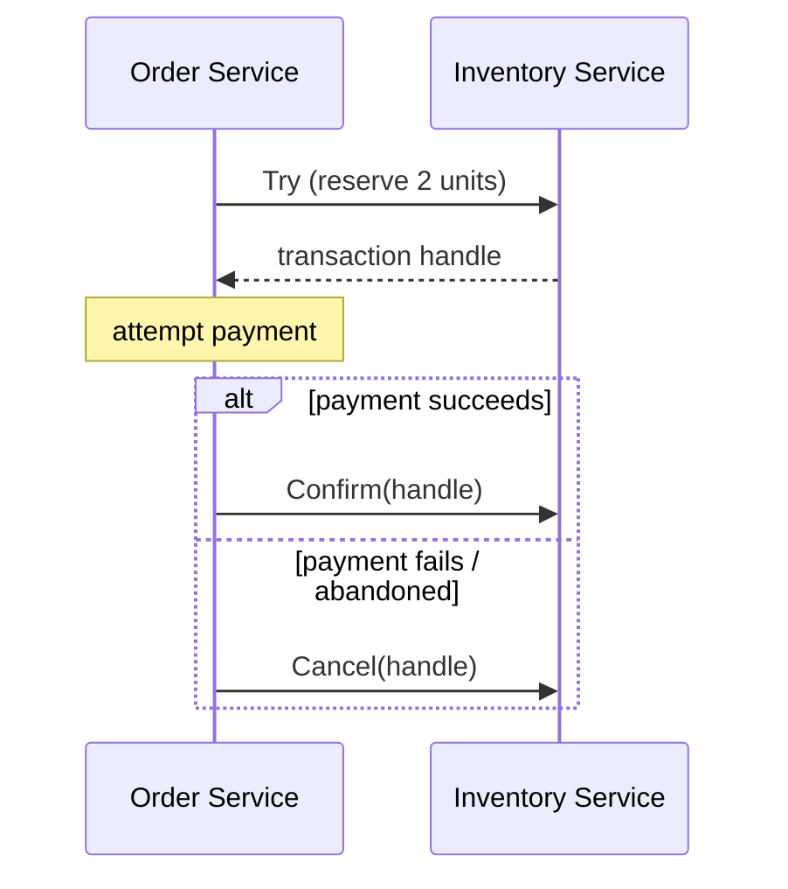
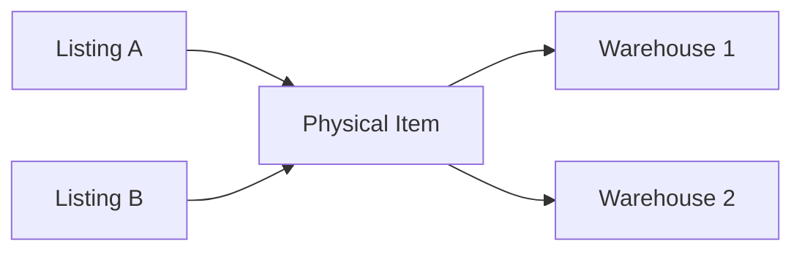
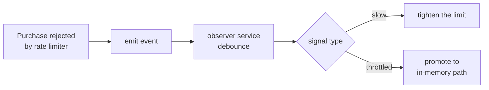
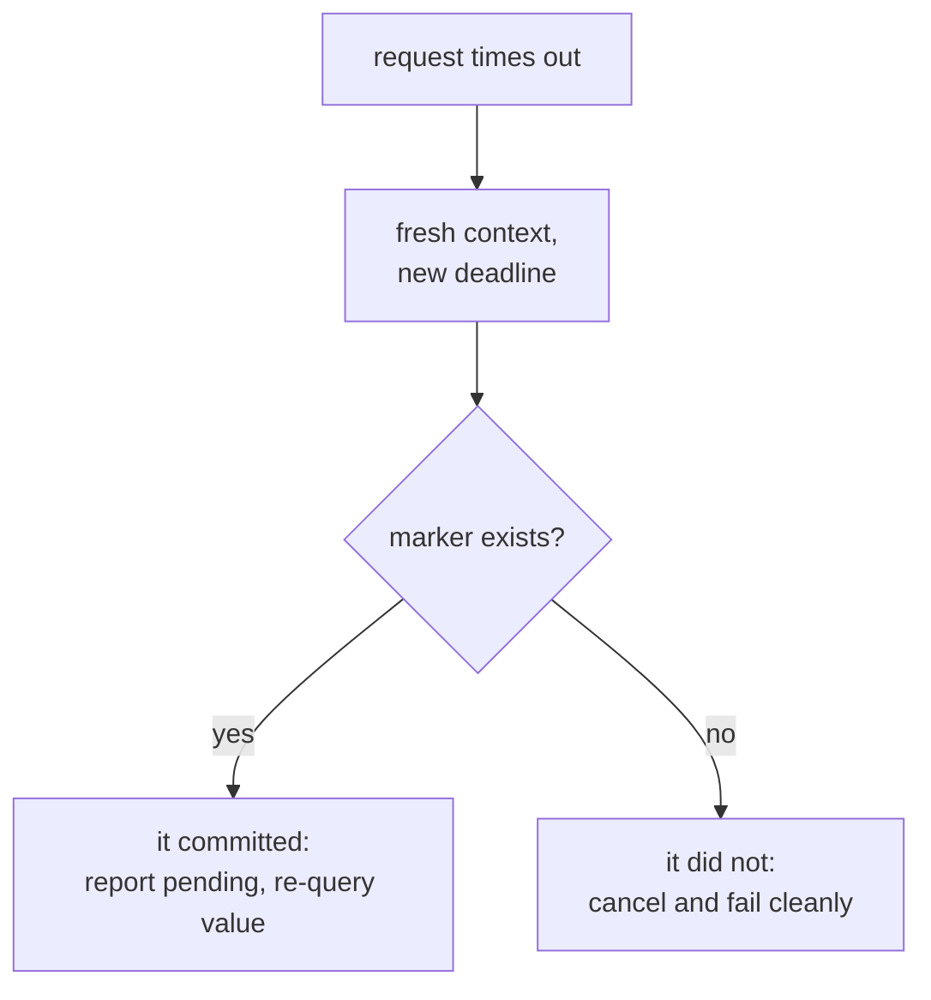
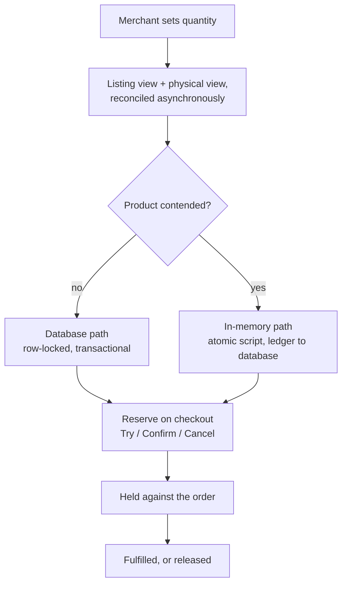

Stock looks like the simplest number in an e-commerce system. It is an integer.
It goes down when someone buys, up when someone cancels. Most engineers would
sketch a solution in a minute: a row in a table, an `UPDATE`, done.

Then a flash sale starts, ten thousand people press *Buy* on the same product in
the same second, and every assumption in that sketch breaks at once.

This post walks through the problems a marketplace inventory service has to
solve, and the techniques that solve them. It is not about any one codebase — it
is about the shape of the problem, which is remarkably consistent across
companies that have hit this scale.

## Why stock is harder than it looks

Stock is a **contended, monotonic, money-bearing resource**. Three properties,
each adding difficulty:

- **Contended** — during a campaign, a single product absorbs a huge share of
  total site traffic. Everyone converges on one number.
- **Monotonic** — you cannot sell what you do not have. There is a hard floor at
  zero, and crossing it is not a rounding error.
- **Money-bearing** — mistakes are not cosmetic. They generate refunds, angry
  buyers, penalties, and manual cleanup.

The most important thing to internalise early: **the two failure directions are
not symmetric.**

| Failure | What happens | Recoverable? |
| --- | --- | --- |
| **Oversell** | You accept orders you cannot fulfil | Badly. Cancel paid orders, refund, absorb penalties, damage trust |
| **Undersell** | You reject orders you could have fulfilled | Yes. Lost revenue on those attempts, nothing broken |

Undersell costs money once. Oversell costs money, trust, and operational time.
Every design decision that follows leans on this asymmetry — when forced to
choose, a good inventory system fails toward undersell, deliberately and
predictably.

## Problem 1: Buying spans many services, but stock lives in one

A checkout is not one action. It touches cart, order, payment, promotion, and
inventory — separate services, separate databases, no shared transaction. Stock
has to be held while payment is attempted, and released if anything upstream
fails or the buyer abandons.

A naive "decrement on checkout" oversells the moment a payment fails and nobody
puts the units back. A naive "decrement on payment success" oversells because
two buyers can both reach payment for the last unit.

### Solution: a two-phase reservation protocol

Expose stock changes as three operations instead of one:

- **Try** — reserve the units and return a transaction handle. Stock is now
  held, not yet sold.
- **Confirm** — the order succeeded. Make the reservation permanent.
- **Cancel** — something failed. Release the units.



Three details separate a working implementation from a broken one:

**Idempotency is mandatory, not optional.** Networks retry. A caller-supplied
reference, hashed and stored under a unique constraint, means a repeated Try
returns the original handle rather than reserving a second time. Without this,
every network blip during a campaign double-books inventory.

**Somebody has to clean up.** Callers crash between Try and Confirm. Reservations
therefore carry an expiry, and a background sweeper scans for transactions that
were opened and never resolved, cancelling them. Without a sweeper, every crashed
checkout permanently leaks a unit of stock.

**The transaction log will be enormous.** A campaign generates millions of
records that are worthless a day later. Storing them in one table means an
ever-growing table and expensive deletes. Partitioning the log by time — a table
per day or per month — turns cleanup into dropping an old partition, which is
effectively free.

## Problem 2: "Available stock" is not a single number

Ask "how many can I sell?" and the honest answer involves several quantities:

- **Sellable** — physically present and allocated to this channel.
- **Reserved** — set aside for something specific, such as a campaign.
- **Locked** — attached to orders that exist but are not yet fulfilled.

What a buyer can actually purchase is roughly:

```
available = max(0, sellable - reserved - max(0, locked))
```

The inner clamp is not defensive noise. Locked stock can legitimately go
negative during correction flows — an over-release, a partial refund reversal —
and without the clamp a negative lock would silently *inflate* availability.
That is an oversell bug hiding inside an arithmetic simplification.

Order holds need their own record, keyed by order and by the specific location
the stock came from, and it pays to store both the **current** held quantity and
the **original** held quantity. When something goes wrong months later — and it
will — the original value is what lets you reconstruct what should have
happened. Repair tooling is impossible without a baseline to repair toward.

## Problem 3: The same product has two different stock numbers

This one is structural and catches most teams by surprise.

There is **listing stock**: what a product page advertises, keyed by product,
variant, and campaign. And there is **physical stock**: what actually sits in a
warehouse, keyed by item, location, and fulfilment method.

They are not the same, and they are not one-to-one:

- One physical item can be sold through several listings.
- One listing can draw from several warehouses.
- A listing can advertise stock that is physically split across regions.



### Solution: pick a source of truth per case, reconcile asynchronously

You cannot update both sides synchronously — that is a distributed transaction on
the hottest path in the system. Instead:

1. Decide, per product type and per market, **which side is authoritative** for
   writes.
2. Write that side synchronously, inside the reservation protocol above.
3. Propagate to the other side through an **event stream**, asynchronously.

The authoritative side is a configuration decision, not a hardcoded one. Markets
migrate between models over time, and both models must be able to coexist while
that migration runs — often for years.

The cost is a reconciliation window: for a short period the two views disagree.
This is acceptable because the *authoritative* side is always correct, and it is
the side that gates selling. The other side is a read-optimised projection.

## Problem 4: Campaigns carve up the same inventory

A flash sale does not have its own warehouse. It sells the same physical units
as the regular listing, under a different price and a separate quantity cap.
There are two common models, and they behave very differently.

**Fixed reserve** — the campaign gets its own dedicated slice, deducted from the
main pool up front. Simple and safe: two independent counters that never
interact. The cost is stranded inventory. If the campaign under-sells, those
units were unavailable to regular buyers the whole time.

**Floating** — the campaign shares the main pool. Nothing is stranded, and every
unit is sellable through either channel until it is gone. The cost is that a
purchase must now decrement **two** counters — the campaign quota and the shared
pool — and both must hold.

```
Fixed reserve:                    Floating:

  main pool:     [ 800 ]            shared pool:   [ 1000 ]
  campaign:      [ 200 ]            campaign quota:[  200 ]
  (independent)                     (a campaign sale decrements BOTH)
```

The floating model is where oversell bugs breed. If the two decrements are not
atomic, a burst of concurrent purchases can pass the quota check while the pool
underflows, or vice versa. **Both counters must be validated and written in a
single atomic step, or the model is unsafe.** More on how to do that below.

Related variants worth planning for: campaign quantity that changes mid-flight,
per-buyer or per-round purchase caps, campaigns that end while orders are still
in flight, and campaigns in one market drawing on stock owned by another. Each
needs its own handling; none of them can be bolted on later without pain.

## Problem 5: One row cannot absorb a flash sale

Here is the wall everyone hits.

A relational database serialises writes to a row. Ten thousand concurrent
decrements of the same row means ten thousand transactions queueing on one lock.
Latency climbs, connections pile up, timeouts cascade, and the database starts
struggling on *unrelated* queries because the connection pool is exhausted.

You cannot tune your way out of this. The row is a serialisation point, and the
only fix is to stop writing to it during the spike.

### Solution: move the counter to an in-memory store, atomically

Relocate the contended counter into an in-memory data store (Redis, typically),
where a single-threaded server can process the same volume of operations orders
of magnitude faster.

But a bare "read, subtract, write" from application code is a lost update
waiting to happen. The read-modify-write must execute **inside** the store, as
one atomic unit — which is what server-side scripting is for.

A useful mental model for what the script must do:

```
1. read the counter
2. if it does not exist        -> error, do not invent it
3. compute the new value
4. if the new value would be negative -> return the shortfall, WRITE NOTHING
5. write the new value, refresh its expiry
6. write a marker recording this transaction
7. return the new value
```

Several of these steps are less obvious than they look.

**Step 2 — never treat a missing counter as zero.** The obvious implementation
uses the store's built-in decrement command. Resist it. Built-in increment and
decrement operations *create the key if it is absent*, treating "missing" as
zero. In this system a missing counter means the cache lost data, and inventing
a counter out of nothing turns a cache outage into unlimited overselling. An
explicit read lets you distinguish "empty" from "gone" and reject the second.

**Step 4 — validate before writing, especially across several counters.** With a
built-in decrement you apply first and discover the problem afterwards, which
means compensating writes — and in the floating-campaign case, several of them,
any of which can fail. Reading and computing first gives you a **dry run**: check
every counter, and only commit once all of them pass. This is what makes the
two-counter floating model safe. The script becomes all-or-nothing across the
campaign quota, the shared pool, and every affected location.

**Step 4 also returns the shortfall without writing.** The caller learns not just
*that* it failed but *by how much*, which is useful for monitoring and for
deciding whether to suggest a smaller quantity.

**Step 5 — write with an expiry.** Refreshing the expiry on every write means
active products stay resident and idle ones age out naturally. A separate expiry
command would be a second round trip.

**Step 6 — the marker is the point.** More on this shortly.

One infrastructure caveat: in a clustered in-memory store, a script can only
touch keys living on the same node. Since a single purchase may update the
campaign quota, the shared pool, and per-location counters together, all of a
product's keys must be **deliberately co-located** — most stores support this
through a key-naming convention that pins related keys to the same shard. Getting
this wrong does not show up in development with a single node; it shows up in
production as scripts failing on cross-node access.

## Problem 6: Deciding *which* products get this treatment

Serving every product from the in-memory path would be wasteful and would make
the cache a single point of failure for the whole catalogue. Only a tiny
fraction of products are ever contended — but which ones is not known in
advance. Merchandising plans change, items go viral, an influencer posts a link.

### Solution: let the system detect contention itself

The elegant approach is to reuse a mechanism you already need. Per-product rate
limiting exists anyway, to stop one product from consuming the whole service's
capacity. That limiter is also a perfect **contention detector**: a product that
is being throttled is, by definition, a product too hot for the normal path.



Two signals, two different responses:

- **Rising latency** — the product is struggling but not yet saturated. Response:
  *tighten* its rate limit and protect the rest of the system.
- **Active throttling** — buyers are being rejected. Response: **promote** the
  product to the in-memory path, then *raise* its limit, because the new path can
  absorb the traffic.

A few practical points:

**Debounce aggressively.** A contended product emits a rejection signal on every
throttled request — thousands per second. Without collapsing that storm into a
single decision, you have replaced one hotspot with another.

**Promotion needs an eligibility check.** Not every product is safe to promote.
Anything with an unusual stock structure, a scheduled quantity change, an
in-flight data migration, or an unsupported campaign type should be refused
outright. It is far better to keep a difficult product on the slower, simpler
path than to run it through machinery that does not fully handle it.

**Promote the whole product, not one campaign.** If the regular listing and its
campaigns share a pool, promoting only one of them breaks the invariant that both
counters move together. Migration has to cover every counter belonging to that
product at once.

**Take a lock while promoting.** Several rejection signals arrive simultaneously;
without mutual exclusion, several workers will try to seed the cache at once and
can write conflicting starting values.

**Seed from the database under a row lock**, inside the transaction that marks
the product as promoted. The value written to the cache and the marker saying
"this product is now cache-backed" must agree.

**Accept the opening window.** Detection is reactive, so the first buyers to hit
the spike are rejected while promotion happens. That is a real, deliberate cost:
a few seconds of failed purchases in exchange for never overselling. Whether it
is acceptable depends on your business, and it is worth being explicit about
rather than discovering later.

## Problem 7: The cache is now the source of truth. What if it dies?

Once a product is cache-backed, the database row is a stale snapshot from
promotion time. This is the uncomfortable consequence of the whole design, and it
has to be confronted directly.

**Do not fall back to the database on a cache miss.** It is the instinctive
reaction and it is exactly wrong. The database value is the pre-promotion
snapshot; serving from it would resell everything sold since. A missing counter
must be a **hard error that rejects the purchase**. The product becomes
temporarily unsellable — undersell, the recoverable failure — rather than
massively oversold.

**Keep the durable record in the database anyway.** The in-memory store should
hold *no unique state*. Concretely:

| Durable (database) | Ephemeral (cache) |
| --- | --- |
| Reservation records and their status | The live counter |
| A ledger row for every confirmed change | Transaction status markers |
| Which products are currently cache-backed | |
| The pre-promotion baseline | |

Each confirmed change writes a ledger row **in the same database transaction as
the reservation confirm**. That single detail is what makes the cache
reconstructible: baseline plus replayed ledger equals current state. A separate
background worker drains that ledger into the main stock records continuously, so
the database is always converging on the truth rather than waiting for a big
reconciliation at the end.

### The timeout problem: did my write land?

A client times out waiting for the store. The operation may have succeeded, may
not have. Retrying risks double-decrementing; not retrying risks losing the
purchase. You genuinely cannot tell from the error.

This is why the script writes a **transaction marker in the same atomic step as
the counter update**. Because both happen inside one atomic script, they can
never disagree. The unanswerable question *"did my write land?"* becomes the
trivial question *"does the marker exist?"* — one read.



Two implementation notes that are easy to get wrong:

- **Verify with a fresh deadline.** The original request context has already
  expired — that is why you timed out. Reusing it guarantees the verification
  fails too.
- **Verify on any error, not just timeouts.** A connection reset is equally
  ambiguous. Narrowing the check to timeouts leaves the same hole open.

When the marker confirms the write landed, the honest response to the caller is
"this succeeded, but I cannot tell you the resulting value — re-query." A partial
answer that is true beats a complete answer that is guessed.

## Problem 8: Returning a product to the normal path

Campaigns end. Traffic subsides. The product should go back to the database path
so the cache is not holding state indefinitely.

The surprising part: **a well-designed demotion moves no data at all.**

Because the ledger has been draining to the database continuously, by the time
demotion happens the database should already match the cache. Demotion is
therefore a cutover, not a migration — and the check before it is not really a
consistency check, it is a **"has the background sync caught up?"** check.

```
promotion:   database ──copy──► cache            (data moves)
while hot:   cache ──ledger──► sync ──► database (database stays current)
demotion:    verify they agree, then flip        (no data moves)
```

Demotion should refuse by default and require evidence:

1. **Is it still busy?** Recent traffic must be below a threshold. Crucially,
   this threshold should be *different* from the promotion threshold — that gap
   is the hysteresis that stops a product oscillating between the two paths.
2. **Do the two sides agree?** Compare every counter against its database value.
   Any mismatch blocks the cutover.
3. **If they disagree, is it within tolerance?** A bounded, direction-aware
   allowance: a cache value *lower* than the database usually means a small
   quantity is still held somewhere and is safe to absorb, while the opposite
   direction may mean the database was changed by another path. Anything outside
   the bound needs a human.

Then, in one transaction: clear the promoted marker first (so new traffic routes
to the database), delete the counters second. And keep an emergency override that
skips the checks — when something is badly wrong at 3am, you need a way out that
does not require the system to agree with you.

### The race nobody thinks about until it bites

A purchase reads "this product is cache-backed", and demotion completes before
the purchase reaches the cache. The counter is gone, the purchase fails — even
though the database has plenty of stock.

There are two defensible responses, and it is worth choosing consciously:

- **Prevent it** — have the purchase re-check the routing decision at write time
  and retry on the other path if it changed.
- **Tolerate and detect it** — let it fail closed, and alert when a purchase that
  started on one path finishes on the other.

Most systems land on the second, because the traffic threshold means demotion
usually happens when almost nobody is buying. That reasoning is sound — but note
it only holds in the *demotion* direction. **Promotion fires precisely when
traffic is at its peak**, so the same race in reverse has far more traffic
flowing through it, and its failure direction is oversell rather than undersell.
If you only harden one of the two transitions, harden that one.

## Problem 9: Drift is not a bug, it is a budget

Every technique above buys throughput by giving up synchronous consistency. Two
stock views reconciled asynchronously. A counter in a cache and a ledger draining
to a database. Reservations resolved by a background sweeper.

Drift *will* occur. The mature position is not to pretend otherwise but to treat
it as a budget you manage:

**Make every change auditable.** Every mutation emits a record of what changed,
by how much, and why. Stream it somewhere queryable. When a merchant asks why
their stock is 3 instead of 5, the answer must be reconstructible — and this is
also how you tell a real bug from an unfamiliar-looking correct behaviour.

**Name your edge cases.** Rather than a generic warning, give each known
anomalous state its own identifier and its own alert. It converts "something odd
happened" into "this specific known condition occurred, here is the runbook."

**Compare continuously, not just at cutover.** Sampled background jobs that read
both sides and report differences will find problems long before a customer does.

**Ship repair tooling alongside features.** In a system with this much
asynchrony, some states will need fixing. Tools to recompute a summary, replay a
ledger, or rebuild a hold from its baseline are not an admission of failure —
they are load-bearing infrastructure. Write them early.

**Write down what you accept.** Some inconsistencies are not worth eliminating.
Documenting "in this scenario the two sides can differ by N, and here is why we
accept it" is far better engineering than silently hoping it never happens. Any
implicit tolerance eventually becomes an incident nobody understands.

## Problem 10: Shipping changes to something this critical

Two practices matter more here than in ordinary services.

**Everything behind a runtime switch.** Market allowlists, merchant allowlists,
percentage rollouts, and per-market behaviour toggles — all changeable without a
deploy. When something misbehaves during a campaign, you need seconds, not a
release cycle.

**Test with real load, on separate data.** A shadow path — mirrored tables,
prefixed cache keys, separate rate limiters, all selected by one flag carried on
the request — lets you run genuine load tests against production capacity without
touching production data. For a system whose failure mode only appears under
extreme concurrency, a load test that cannot run at production scale is not
really a test.

And expect old and new models to coexist. Data model migrations here take
quarters, not sprints. Designing so both structures can be served simultaneously,
with per-product routing, is the difference between a migration that ships and
one that stalls.

## Bringing it together

The full lifecycle of a unit of stock:



The principles worth carrying to any inventory system:

1. **Choose your failure direction.** Undersell is recoverable, oversell is not.
   Make it explicit and make it consistent.
2. **Never invent state.** A missing counter is an error, not a zero. Fail closed.
3. **Atomicity where contention is.** Validate everything, then commit
   everything — never apply-then-compensate.
4. **Keep durable state durable.** The fast layer should hold nothing that cannot
   be rebuilt from a log.
5. **Make ambiguity answerable.** A commit marker written atomically with the
   change turns "did it work?" into a single read.
6. **Detect rather than predict.** Let the system discover its own hotspots
   instead of relying on someone to declare them in advance.
7. **Budget for drift.** Audit it, bound it, tool for it, and write down what you
   accept.

None of these are exotic. What makes inventory hard is that you need all of them
working together, on the one path that must never be wrong, while the traffic is
at its highest.
