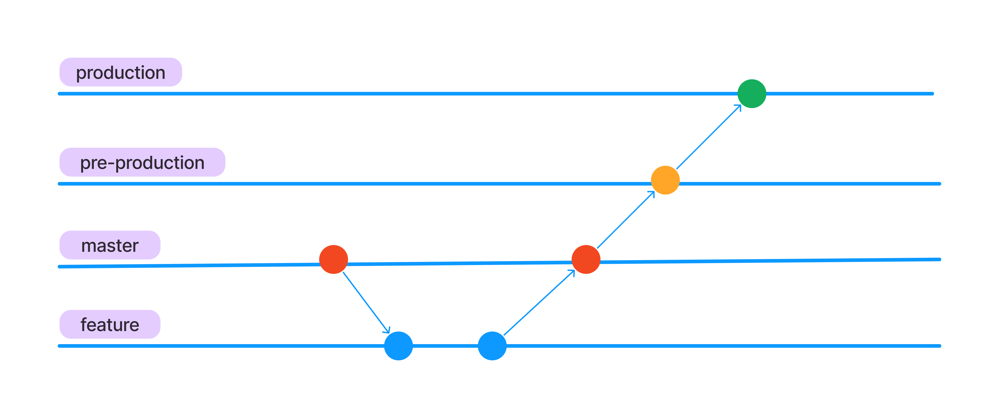

## Introduction

A well-defined Git branching strategy is crucial for smooth team collaboration
and effective Git repository management. Consider this: without a branching
strategy, a developer might decide to work directly on features in the master
branch. This bypasses the safety net of feature branches, leading to untested
code being merged into master and potentially introducing bugs to the production
environment.

While several Git branching strategies exist, including Git flow, GitHub flow,
and trunk-based development, this blog will delve into GitLab flow specifically.

## Gitlab flow

While GitLab Flow offers flexibility to adapt to your system's needs and
complexity, core principles remain constant. Following are the core principles of Gitlab flow

1. Use feature branches rather than direct commits on the master branch
2. Test all commits, not only ones on the master branch
3. Run every test on all commits. (If tests run longer than 5 minutes, they can run in parallel.)
4. Perform code reviews before merging into the master branch
5. Deployments are automatic based on branches or tags
6. Tags are set by the user, not by CI
7. Releases are based on tags
8. Pushed commits are never rebased
9. Everyone starts from master and targets master
10. Fix bugs in master first and release branches second
11. Commit messages reflect intent

## From My Experience

Many companies I've worked with lack standardized Git branching practices like
Git Flow or Gitlab Flow. Instead, they adopt ad-hoc approaches often without
documented strategies. This leads to reliance on senior team members for
knowledge, hindering knowledge sharing and efficiency. In contrast, established
branching strategies offer clarity, scalability, and reduced overhead compared
to creating custom solutions.

Furthermore, these ad-hoc strategies become increasingly problematic as teams
grow, project complexity increases, and CI/CD integration becomes essential. A
consistent approach is crucial for handling these challenges effectively.