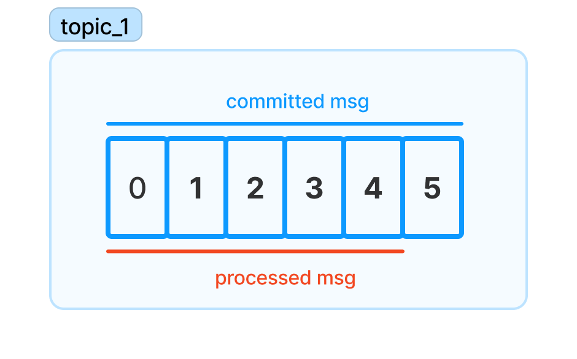

## Kafka Commit And Offset

When a consumer consume messages from a topic, `Kafka` broker only returns the
unread messages to the consumer instead of returning all of the messages of the
topic. Meaning `Kafka` should have a way to keep track of messages that are
already read. And `Kafka` doing that by allow consumers to commit offsets

When a consumer commit offsets, `Kafka` broker will produce a message to a
special topic that is called `__consumer_offsets`, which committed the offset
for each partition. Usually, if a consumer is up, running it will not any
impacts because it only retrieves new messages compare to the last `poll`. But
if it crash or another consumer join or leave the group which in turn trigger a
rebalancing, each consumer may be assigned to a new set of partitions so how the
consumer commit the offsets may cause duplicate or message lost

For example: if the consumers haven't committed the processed messages before the consumer
group rebalancing, it would receive these messages again and process them twice

Or if the consumers even have committed the messages that are not processed yet,
the `Kafka` broker will not return these messages again to the consumers. Hence,
causing message lost

## Auto Commit

## Manual Commit Or Sync Commit

## Async Commit
