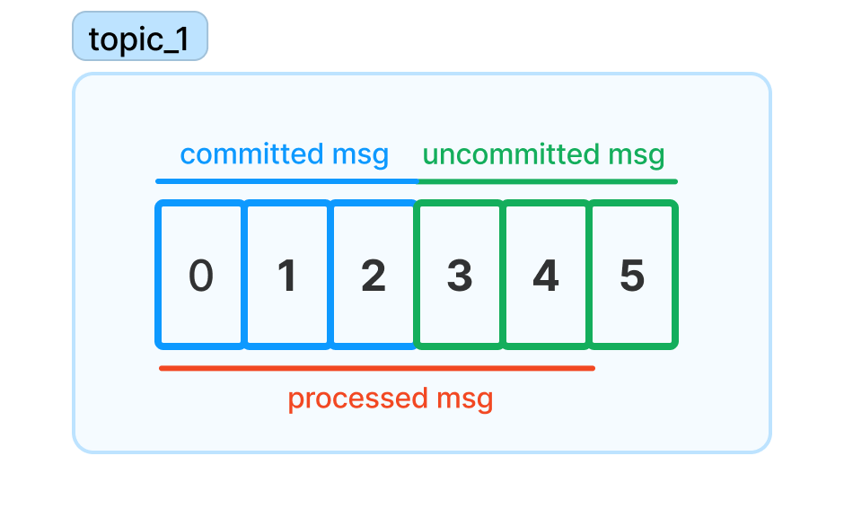

## Kafka Commit And Offset

When a consumer consume messages from a topic, `Kafka` broker only returns the
unread messages to the consumer instead of returning all of the messages of the
topic. Meaning `Kafka` should have a way to keep track of messages that are
already read. And `Kafka` doing that by allow consumers to commit offsets

When a consumer commit offsets, `Kafka` broker will produce a message to a
special topic that is called `__consumer_offsets`, which committed the offset
for each partition. Usually, if a consumer is up, running it will not any
impacts because it only retrieves new messages compare to the last `poll`. But
if it crash or another consumer join or leave the group which in turn trigger a
rebalancing, each consumer may be assigned to a new set of partitions so how the
consumer commit the offsets may cause duplicate or message lost

For example: if the consumers haven't committed the processed messages before the consumer
group rebalancing, it would receive these messages again and process them twice

Or if the consumers even have committed the messages that are not processed yet,
the `Kafka` broker will not return these messages again to the consumers. Hence,
causing message lost

## Auto Commit

If you choose auto commit, the consumer will auto commit the largest offset that
is received by the previous pool if it exceeds the threshold/interval which is 5
seconds by default and the consumer will check if it's time to commit whenever you poll

Even though, auto commit is very convenience but there are some drawbacks such
as if the consumer crash or rebalance occur, messages may be polled twice. You
can reduce the interval to mitigate it but never can eliminate it. And it's
important the you need to process the messages before poll again to avoid
message lost

:::info
Different libraries may have different way to implement the auto commit mode.
But usually the idea is similar. For example: the default interval of
[Sarama](https://github.com/IBM/sarama) is 1 second instead of 5 second
:::

## Manual Commit Or Sync Commit
Manual commit is a way to explicitly commit the current offset instead of
replying on the auto commit. This way developers have more control over the time
when they want to commit the offsets

When you muanual commit, the consumer will commit the largest offset from the
last poll. Hence, making sure that you process all of the messages before of the
previous poll before calling commit otherwise you may suffer from message lost

:::info
Some library instead of committing the largest offset of the last poll, you need
to tell it which offset to commit or what is the largest offset that is processed
For example: [Sarama](https://github.com/IBM/sarama) users need to mark the
processed messages by using `MarkOffset` or `MarkMessage` before calling
`Commit`
:::
## Concurrent Processors And Offset Commit

When you consume messages one by one it normally is easy to guarantee the
unprocessed messages will not be committed but it may have performance issue.
Hence, some developers choose to process messages concurrently but they will
need to handle the commit more carefully because larger offset messages can be
processed before the smaller offset messages. So it may cause message lost if
they commit the larger offset messages without waiting for the smaller offset
messages to be processed. 

One of the solution to guarantee the commit ordering is to have a marked buffer
to keep track of the offsets of the processed messages ensure all of the smaller
offsets are marked before commit a offset