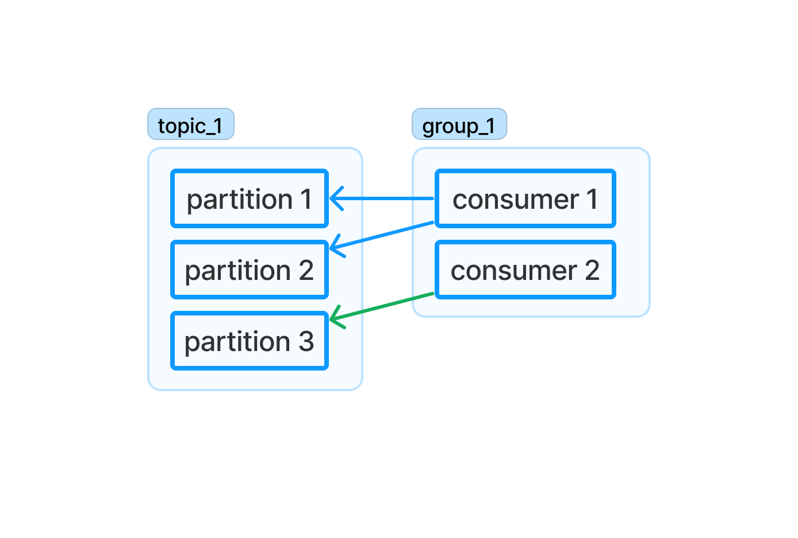
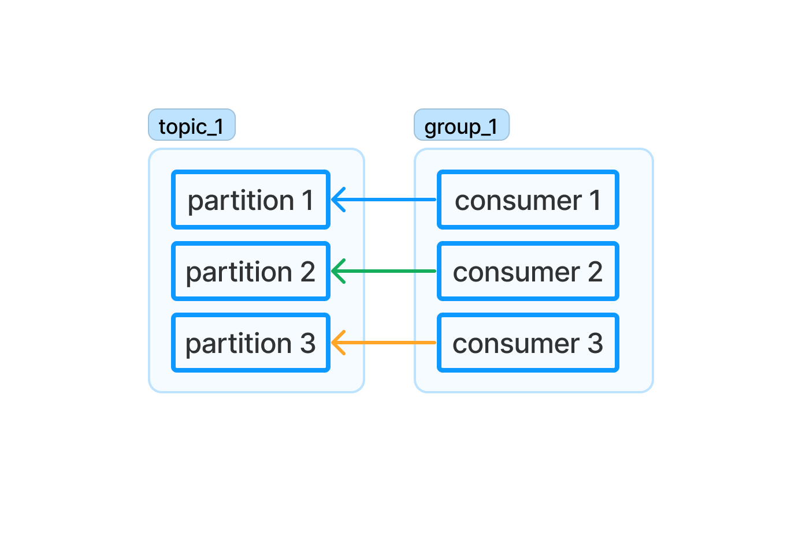
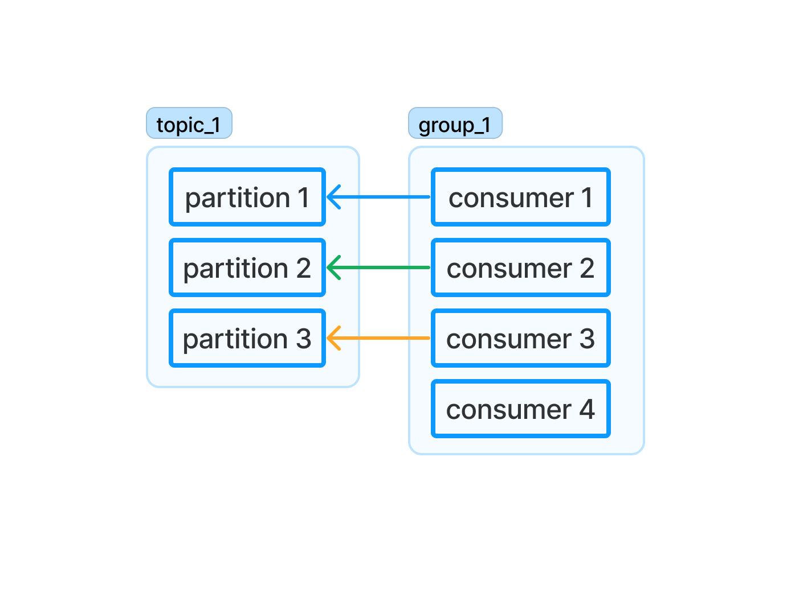
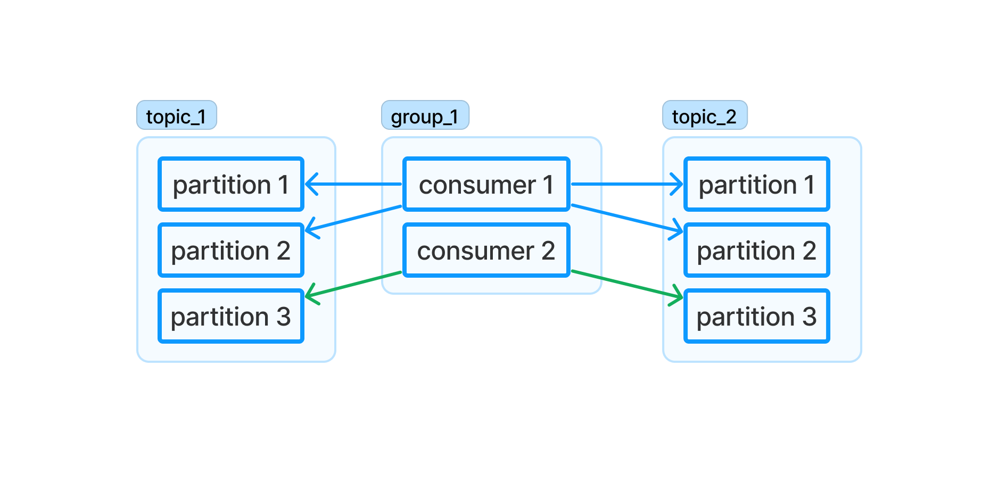
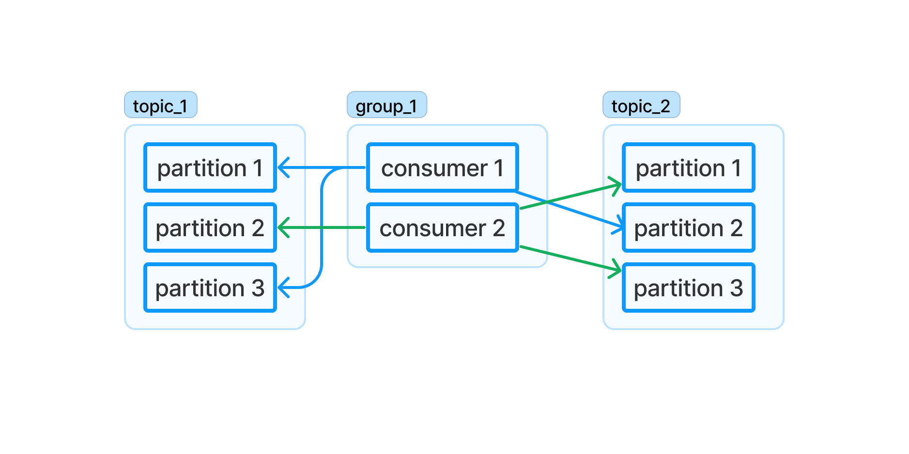
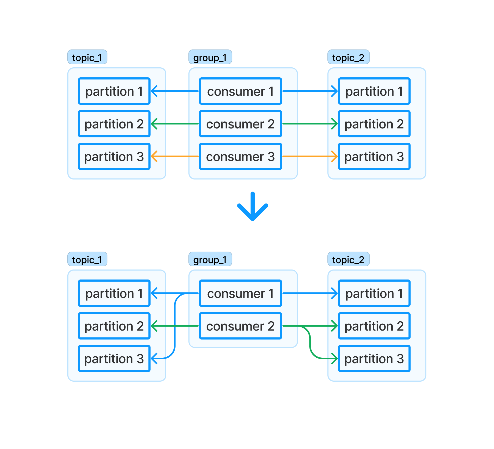

## Consumer Group And Partition Assignment

In order to boost the consuming performance, Kafka allows multiple consumers to
consume from the same topic. But it also needs to ensure the "exactly-once" so
its solution is to make sure one partition can only be consumed by only one
consumer of a consumer group and one consumer can consume from multiple partitions

Like in the figure above, **partition 1** and **partition 2** are consumed by
**consumer 1** and **partition 3** is consumed by **consumer 2**. There is no
partition that is consumed by one more than consumer

If you add one more consumer so the number of partitions and consumers are
equal, it will rebalance the partition assignment. And this time each consumer
will consume from one partition

If you add one more consumer so the number of consumers are greater than the
number of partitions by one. One consumer will become idle and not consuming
from any partition because as mentioned above one partition can only be consumed
by one consumer

## Partition Assignment Strategy
There are two important rules of partition assignment which are
- One consumer can consume from multiple partitions of a topic
- One partition can only be consumed by one consumer of a consumer group

It not only has to guarantee those two rules, but also need to avoid the
partitions are not assigned evenly as much as possible. There are several ways
to implement a partition assignment algorithm. Let's go through them one by one
### Range

[Range](https://kafka.apache.org/0110/javadoc/org/apache/kafka/clients/consumer/RangeAssignor.html)
is the default partition assignment algorithm of many `Kafka` client library.
It splits the partitions of each topic into ranges and each range contains
consecutive partitions and assign each range to the consumers.

For example: in the figure above, **T1_P1**(topic 1, partition 1), **T1_P2**,
**T2_P1**, and *T2_P2** are assigned to **C1** (consumer 1) whereas **T1_P3**,
and **T2_P3** are assigned to *C2**. You can see that this algorithm can ensure
evenly distribution in one topic but across the topics the distribution is not
evenly
### Round Robin

[Round robin](https://kafka.apache.org/0110/javadoc/org/apache/kafka/clients/consumer/RoundRobinAssignor.html) assign each partition of all partitions of all topic sequentially to each consumer

For example: in the figure above, **T1_P1**, **T1_P3**, and **T2_P2** are
assigned to **C1** whereas **T1_P2**, **T2_P1**, and **T2_P3** are assigned to
**C2**. Better than range algorithm, round robin algorithm can ensure evenly
distribution across all the topics

### Sticky

[Sticky algorithm](https://kafka.apache.org/0110/javadoc/org/apache/kafka/clients/consumer/StickyAssignor.html) 
is similar to round robin except that it preserve as many existing assignment as
possible when a reassignment occurs.

For example: in the figure above, after removing **C3**, **T1_P1**, and
**T2_P1** are still assigned to **C1**, **T1_P2**, and **T2_P2** are still
assigned to **C2**. And **C3's** partitions *T1_P3** is assigned to **C1**,
**T2_P3** is assigned to **C2**
