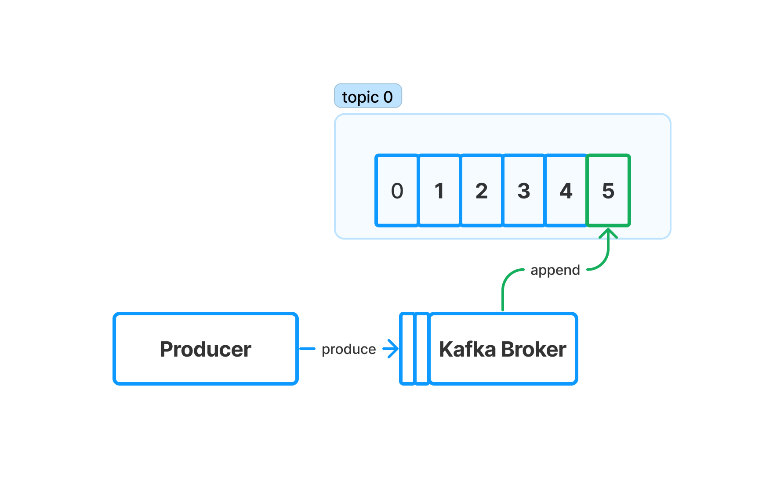
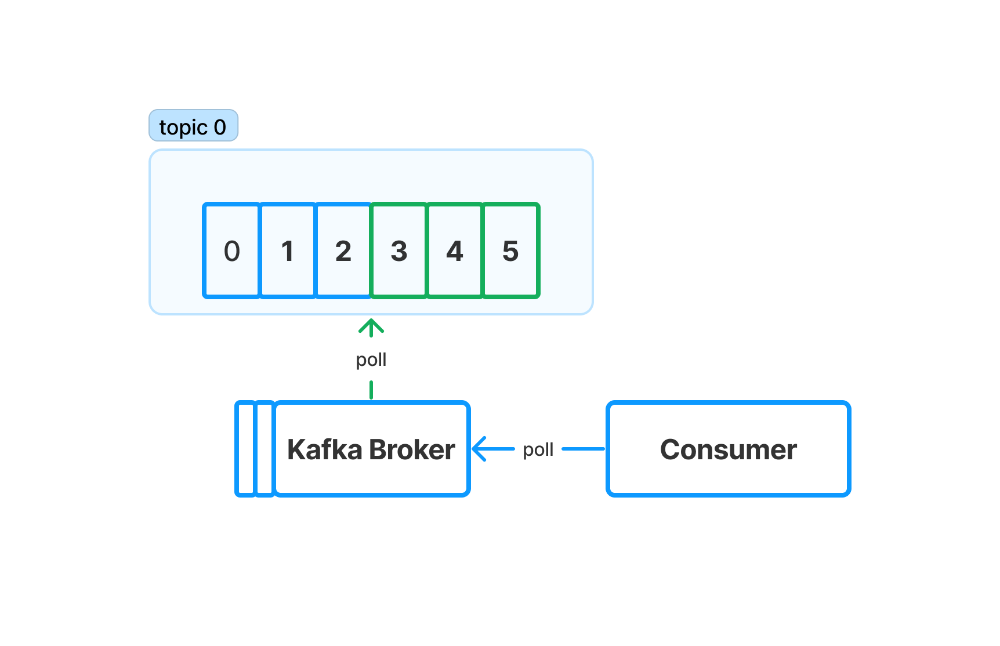
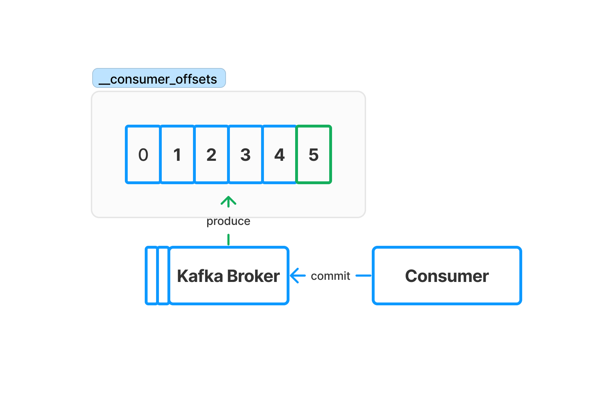

## Kafka Topic

A `Kafka` topic is essentially a category or a stream for organizing messages in
`Apache Kafka`.  Imagine it like a folder in a filing cabinet, but for data
streams where producers can produce (push) messages to and consumers can
consume (poll) messages from

Each message of the topic is assigned to a unique number called offset. It
essentially acts as a sequential counter that indicates the position of a
message within the ordered sequence of messages

## Producer Produce

When a producer produce a message to a topic. `Kafka` broker will increase the
offset by one and append the new message to the topic

## Consumer Poll

When a consumer poll the messages from a topic, the `Kafka` broker will return the
unread messages in the same order that they're written

## Consumer Commit

When a consumer commit a message to a topic. Kafka broker will produce a message
to the special topic `__consumer_offsets` to mark the latest read offset

## Partition

Because Kafka broker will only append the messages to the topic. Hence, if all
of the producers produce to and consumers consume from the topic. It may affect
the performance. Hence, Kafka topic can have partitions. 

Producers can shard the data by partitions by sending the message with `key`
field or can leave the `key` empty and let the Kafka broker choose the
partition.

Each consumer of a consumer group can consume messages from multiple partitions.
But a partition shouldn't be consumed by more than one consumer in the same group
