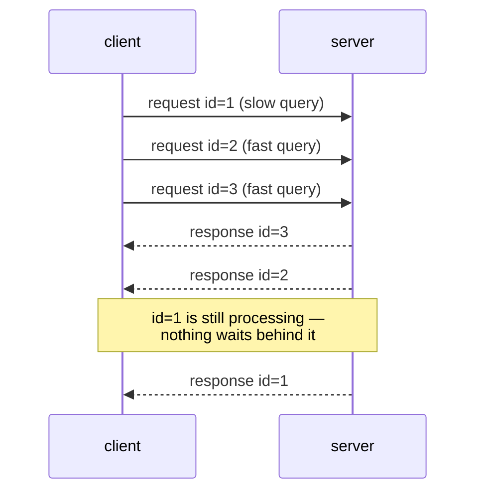
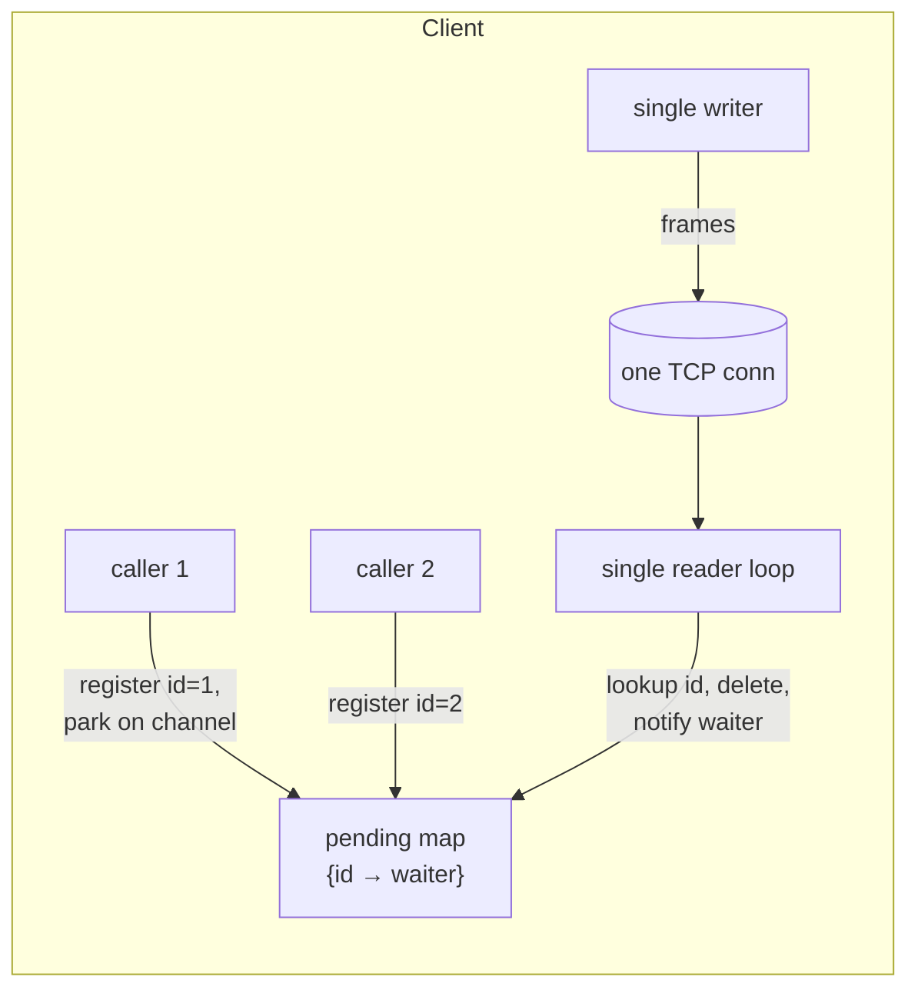

## Introduction

The first time I inspected the open sockets of a busy gRPC service, I saw
something that would have shocked my younger self: the process was handling
hundreds of concurrent calls to another service, yet `netstat` showed only
**a single TCP connection** between them. No connection per request, no big
pool, no waiting for one response before sending the next call. Just one
socket, saturated with interleaved traffic in both directions.

The technique that makes this possible is **multiplexing**, and once you see
it, you'll find it everywhere: HTTP/2, gRPC, Kafka's wire protocol, SSH, and
nearly every modern RPC framework. In this post I want to build it up from
first principles: the problem it solves, the surprisingly small mechanism at
its core, and the trade-offs that come with it.

<!--truncate-->

## Life Before Multiplexing

Consider a client that needs to make many concurrent calls to the same server.
Without multiplexing, a connection can only serve **one request at a time**:
you write a request, then you must read its response before the connection is
usable again — because the only way to know which response belongs to which
request is *ordering*. This gives you two bad options:

**Option 1: a connection per in-flight request.** This is HTTP/1.1 with a
connection pool. To run 500 concurrent requests you need 500 connections, and
each one costs you:

- a TCP handshake (1 RTT) and usually a TLS handshake (1–2 more RTTs),
- kernel memory for buffers and file descriptors on both sides,
- TCP slow start — every *new* connection begins with a small congestion
  window and has to re-learn the network's capacity,
- and at scale, ephemeral port exhaustion between busy client/server pairs.

Worse, in a microservice system this multiplies: *M* client instances each
pooling *K* connections to *N* server instances is an `M × N × K` connection
mesh. The socket counts alone become an operational problem.

**Option 2: pipelining.** Send several requests back-to-back without waiting,
and read responses *in order*. HTTP/1.1 pipelining and classic Redis pipelining
work this way. It amortizes round trips, but the in-order constraint creates
**head-of-line (HOL) blocking**: if request #1 takes 2 seconds to process, the
responses for #2 and #3 — even if they finished in a millisecond — must sit in
a queue behind it. One slow query stalls everyone sharing the connection.

## The Core Idea: Stop Relying on Order

Multiplexing fixes this with one small change to the protocol: **every request
carries a unique ID, and every response echoes it back**. Once responses are
self-describing, ordering stops mattering — the server can answer in whatever
order the work completes, and many logical conversations can interleave freely
on one connection.



To make interleaving physically possible, messages are wrapped into **frames**
with an explicit length (and, in stream-oriented protocols like HTTP/2, large
messages are split into multiple frames so a big payload can't monopolize the
pipe). The receiver reads frame by frame, looks at the ID, and routes each one
to the right waiting caller.

Different protocols name the ID differently — HTTP/2 calls it a *stream ID*,
Kafka a *correlation ID*, most RPC frameworks a *request ID* — but it's the
same trick.

## What the Implementation Actually Looks Like

The elegance of multiplexing is how little machinery it needs on the client.
Nearly every implementation, in any language, reduces to three pieces:



1. **A pending-call map**, keyed by request ID, holding a "waiter" per
   in-flight request — a channel, promise, future, or callback, depending on
   the language.
2. **A writer path** that serializes frames onto the socket (a lock or a
   dedicated writer goroutine/thread — two requests must never interleave
   *bytes*, only *frames*).
3. **A single reader loop** that reads one frame at a time, pops the matching
   entry out of the map, and hands the response to that waiter.

In Go this is idiomatic to the point of being boring — each caller does:

```go
done := make(chan Response, 1)     // buffer 1: the notifier never blocks
pending.Store(reqID, done)
conn.WriteFrame(req)
resp := <-done                     // park until reader loop delivers
```

and the reader loop does:

```go
for {
    frame := conn.ReadFrame()
    if waiter, ok := pending.LoadAndDelete(frame.ID); ok {
        waiter <- frame.Response
    }
}
```

Three details separate a toy from a production implementation:

- **Timeouts are per-request, not per-connection.** Each call arms its own
  timer; if it fires first, the entry is removed from the map and the waiter
  gets a timeout error. Whichever of {response, timeout, connection-close}
  deletes the map entry first wins — the map is the arbiter, so the caller is
  notified exactly once.
- **Connection death must fail everyone.** When the socket breaks, the reader
  loop drains the *entire* pending map and delivers an error to every waiter.
  Forgetting this leaks goroutines/promises that wait forever.
- **Keep the reader loop thin.** If the reader does expensive work (like
  deserializing a huge payload) inline, it stalls delivery for every other
  stream. Good implementations hand off decoding to the waiter's own thread —
  the reader just routes bytes.

Add flow control (don't let one stream buffer unbounded data), a cap on
in-flight requests, and periodic keepalives to detect dead peers, and you've
essentially re-derived HTTP/2's design.

## Multiplexing in the Wild

- **HTTP/2 / gRPC**: the flagship example — streams, per-stream flow control,
  header compression. gRPC channels ride on a small number of HTTP/2
  connections regardless of call volume. This is also what makes service mesh
  sidecars cheap: proxy-to-proxy traffic collapses onto a few multiplexed
  connections instead of an N×M socket explosion.
- **Kafka**: every request header carries a `correlation_id`; a client keeps
  one connection per broker and pipelines/multiplexes over it.
- **SSH**: your terminal, port forwards, and file transfers are independent
  *channels* over one encrypted connection.
- **HTTP/3 / QUIC**: multiplexing pushed one layer down — more on this below.

The counter-examples are just as instructive: **PostgreSQL and MySQL wire
protocols are not multiplexed.** One connection = one query at a time, which is
why database connection *pools* (and poolers like PgBouncer) remain essential
infrastructure, and why "how many DB connections do we have?" is a capacity
question in a way that "how many gRPC connections?" is not.

## The Trade-offs

Multiplexing removes application-level HOL blocking, but it isn't free:

- **TCP-level HOL blocking remains.** All those independent streams still share
  one TCP byte stream. If a single packet is lost, TCP holds back *everything*
  behind it until retransmission — even frames belonging to unaffected streams.
  This is the problem QUIC (HTTP/3) solves by giving each stream independent
  loss recovery on top of UDP: with multiplexing at the transport layer, one
  stream's packet loss no longer stalls its neighbors.
- **Bigger blast radius per connection.** One connection now carries hundreds
  of requests, so a connection reset fails hundreds of callers at once, and a
  reconnect is a visible latency event. Implementations mitigate with graceful
  draining: the peer says "closing soon", new requests move to a fresh
  connection, in-flight ones finish on the old one.
- **Single-connection throughput ceilings.** One socket means one reader and
  serialized writes; at very high throughput, CPU on those paths (and TCP's
  per-connection congestion window) becomes the bottleneck. That's why mature
  clients still keep a *small* pool of multiplexed connections and spill over
  to a fresh one when the busiest gets too loaded — rather than exactly one.
- **Fairness needs design.** Without frame-size limits and flow control, one
  chatty stream can starve the rest. HTTP/2's stream prioritization exists
  precisely because sharing needs rules.

## Takeaways

- Multiplexing = **frames + request IDs + a pending map**. Responses stop
  depending on order, so one connection can carry unlimited interleaved
  conversations.
- It exists to kill two problems at once: the **cost of many connections**
  (handshakes, slow start, socket explosion) and the **HOL blocking of
  pipelining**.
- The client-side mechanism is tiny — a map of waiters, a thin reader loop,
  per-request timers — but the edge cases (connection death, timeout races,
  slow-reader stalls) are where implementations earn their keep.
- Know your protocol: gRPC/HTTP/2/Kafka multiplex (few connections is fine);
  PostgreSQL/MySQL don't (pool sizing still matters).
- And when someone asks why HTTP/3 exists, the one-line answer is:
  *multiplexing worked so well at the application layer that the last
  remaining HOL blocking — TCP's — had to be fixed by moving multiplexing into
  the transport itself.*
