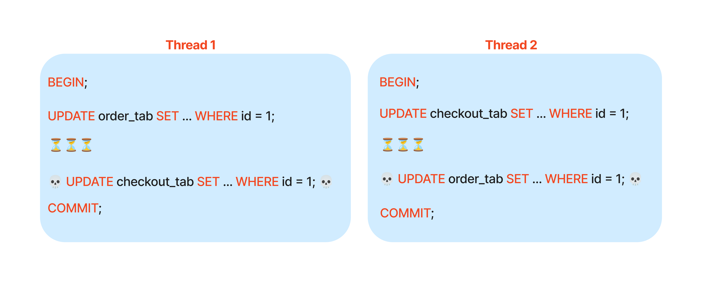

## What is deadlock

In my previous blog about MySQL locking I introduced how locking can help to
ensure the atomicity and avoid race condition. But misuse locking can lead a a
symptom called deadlock which caused the transactions are blocked and unable to process
the rest queries of the transactions

## Common causes and detection

Deadlocks in MySQL typically arise from various factors that create circular
dependencies between transactions. One common cause is conflicting query order,
where two or more transactions attempt to lock resources (rows or tables) in a
different sequence, leading to a standstill. Another frequent issue is the lack
of proper indexing, which forces MySQL to scan more rows than necessary,
increasing the likelihood of lock contention. Additionally,
long-running transactions exacerbate the problem by holding locks for extended
periods, blocking other operations. Understanding these scenarios is key to
diagnosing and preventing deadlocks in MySQL.

In the example below, two threads try to update the same order and checkout
but they attempt to lock them in a different sequence. This causes each thread
to wait for the other, resulting in a deadlock where both are blocked
indefinitely.



## How to troubleshoot deadlock
Many databases, including MySQL, have a built-in deadlock detection mechanism.
For more details, you can refer to their
[official doc](https://dev.mysql.com/doc/refman/8.4/en/innodb-deadlock-detection.html)

:::info
When deadlock detection is enabled (the default), InnoDB automatically detects
transaction deadlocks and rolls back a transaction or transactions to break the
deadlock. InnoDB tries to pick small transactions to roll back, where the size
of a transaction is determined by the number of rows inserted, updated, or
deleted.
:::

When deadlock detection is enabled, you can see the latest deadlock by using
`SHOW ENGINE InnoDB STATUS;`

```sql
LATEST DETECTED DEADLOCK
------------------------
2025-01-18 04:01:40 0x7fa4c4182700
*** (1) TRANSACTION:
TRANSACTION 513806, ACTIVE 37 sec starting index read
mysql tables in use 1, locked 1
LOCK WAIT 4 lock struct(s), heap size 1136, 2 row lock(s), undo log entries 1
MySQL thread id 6, OS thread handle 140345641010944, query id 44 172.21.0.1 root updating
update order_tab set name ="old" where id =1
*** (1) WAITING FOR THIS LOCK TO BE GRANTED:
RECORD LOCKS space id 1035 page no 3 n bits 72 index PRIMARY of table `sakila`.`order_tab` trx id 513806 lock_mode X locks rec but not gap waiting
Record lock, heap no 2 PHYSICAL RECORD: n_fields 4; compact format; info bits 0
 0: len 4; hex 80000001; asc     ;;
 1: len 6; hex 00000007d70d; asc       ;;
 2: len 7; hex 2d0000013f0110; asc -   ?  ;;
 3: len 3; hex 6e6577; asc new;;

*** (2) TRANSACTION:
TRANSACTION 513805, ACTIVE 52 sec starting index read
mysql tables in use 1, locked 1
4 lock struct(s), heap size 1136, 2 row lock(s), undo log entries 1
MySQL thread id 2, OS thread handle 140345641281280, query id 45 172.21.0.1 root updating
update checkout_tab set name = "old" where id =1
*** (2) HOLDS THE LOCK(S):
RECORD LOCKS space id 1035 page no 3 n bits 72 index PRIMARY of table `sakila`.`order_tab` trx id 513805 lock_mode X locks rec but not gap
Record lock, heap no 2 PHYSICAL RECORD: n_fields 4; compact format; info bits 0
 0: len 4; hex 80000001; asc     ;;
 1: len 6; hex 00000007d70d; asc       ;;
 2: len 7; hex 2d0000013f0110; asc -   ?  ;;
 3: len 3; hex 6e6577; asc new;;

*** (2) WAITING FOR THIS LOCK TO BE GRANTED:
RECORD LOCKS space id 1036 page no 3 n bits 72 index PRIMARY of table `sakila`.`checkout_tab` trx id 513805 lock_mode X locks rec but not gap waiting
Record lock, heap no 2 PHYSICAL RECORD: n_fields 4; compact format; info bits 0
 0: len 4; hex 80000001; asc     ;;
 1: len 6; hex 00000007d70e; asc       ;;
 2: len 7; hex 2e000001800110; asc .      ;;
 3: len 3; hex 6e6577; asc new;;

*** WE ROLL BACK TRANSACTION (2)
```

If a deadlock is not detected automatically, you can manually inspect the
current transactions and locked rows using the `SHOW ENGINE INNODB STATUS`
command. The resulting log provides valuable information, including:

- **Transaction ID and thread ID**: Identifies the transactions involved.
- **Rows locked by each transaction**: Highlights the rows currently locked.
- **Query of each transaction**: Shows the specific SQL query causing the lock.
- **Table and lock details**: Indicates which table each transaction is waiting to acquire a lock for.


```sql
TRANSACTIONS
------------
Trx id counter 513819
Purge done for trx's n:o < 513818 undo n:o < 0 state: running but idle
History list length 2
LIST OF TRANSACTIONS FOR EACH SESSION:
---TRANSACTION 421820994702992, not started
0 lock struct(s), heap size 1136, 0 row lock(s)
---TRANSACTION 513818, ACTIVE 16 sec starting index read
mysql tables in use 1, locked 1
LOCK WAIT 4 lock struct(s), heap size 1136, 2 row lock(s), undo log entries 1
MySQL thread id 6, OS thread handle 140345641010944, query id 93 172.21.0.1 root updating
update order_tab set name ="old" where id =1
------- TRX HAS BEEN WAITING 8 SEC FOR THIS LOCK TO BE GRANTED:
RECORD LOCKS space id 1035 page no 3 n bits 72 index PRIMARY of table `sakila`.`order_tab` trx id 513818 lock_mode X locks rec but not gap waiting
Record lock, heap no 2 PHYSICAL RECORD: n_fields 4; compact format; info bits 0
 0: len 4; hex 80000001; asc     ;;
 1: len 6; hex 00000007d718; asc       ;;
 2: len 7; hex 33000001860110; asc 3      ;;
 3: len 3; hex 6e6577; asc new;;

------------------
---TRANSACTION 513816, ACTIVE 33 sec starting index read
mysql tables in use 1, locked 1
LOCK WAIT 4 lock struct(s), heap size 1136, 2 row lock(s), undo log entries 1
MySQL thread id 2, OS thread handle 140345641281280, query id 94 172.21.0.1 root updating
update checkout_tab set name = "new" where id =1
------- TRX HAS BEEN WAITING 3 SEC FOR THIS LOCK TO BE GRANTED:
RECORD LOCKS space id 1036 page no 3 n bits 72 index PRIMARY of table `sakila`.`checkout_tab` trx id 513816 lock_mode X locks rec but not gap waiting
Record lock, heap no 2 PHYSICAL RECORD: n_fields 4; compact format; info bits 0
 0: len 4; hex 80000001; asc     ;;
 1: len 6; hex 00000007d71a; asc       ;;
 2: len 7; hex 34000001870110; asc 4      ;;
 3: len 3; hex 6f6c64; asc old;;

------------------
```
The `SHOW ENGINE INNODB STATUS` command can be helpful in diagnosing some cases of
deadlocks. However, when your database has a high volume of transactions,
identifying the root cause through this method can be challenging. In such
situations, it is often more effective to query MySQL's metadata tables, such
as:
- **INFORMATION_SCHEMA.INNODB_LOCK_WAITS**: contains one or more rows for each
blocked InnoDB transaction, indicating the lock it has requested and any locks
that are blocking that request.
- **INFORMATION_SCHEMA.INNODB_TRX**: provides information about every transaction
currently executing inside InnoDB, including whether the transaction is waiting
for a lock, when the transaction started, and the SQL statement the transaction
is executing, if any.
- **INFORMATION_SCHEMA.INNODB_LOCKS**: provides information about each lock that an
InnoDB transaction has requested but not yet acquired, and each lock that a
transaction holds that is blocking another transaction.
- **INFORMATION_SCHEMA.PROCESSLIST**: the MySQL process list indicates the
operations currently being performed by the set of threads executing within the
server.

The below is one sample query from the [High Performance MySQL
book](https://www.amazon.sg/High-Performance-MySQL-Baron-Schwartz/dp/1449314287)

```sql
SELECT r.trx_id AS waiting_trx_id, r.trx_mysql_thread_id AS waiting_thread,
 TIMESTAMPDIFF(SECOND, r.trx_wait_started, CURRENT_TIMESTAMP) AS wait_time,
 r.trx_query AS waiting_query,
 l.lock_table AS waiting_table_lock,
 b.trx_id AS blocking_trx_id, b.trx_mysql_thread_id AS blocking_thread,
 SUBSTRING(p.host, 1, INSTR(p.host, ':') - 1) AS blocking_host,
 SUBSTRING(p.host, INSTR(p.host, ':') +1) AS blocking_port,
 IF(p.command = "Sleep", p.time, 0) AS idle_in_trx,
 b.trx_query AS blocking_query
FROM INFORMATION_SCHEMA.INNODB_LOCK_WAITS AS w
INNER JOIN INFORMATION_SCHEMA.INNODB_TRX AS b ON b.trx_id = w.blocking_trx_id
INNER JOIN INFORMATION_SCHEMA.INNODB_TRX AS r ON r.trx_id = w.requesting_trx_id
INNER JOIN INFORMATION_SCHEMA.INNODB_LOCKS AS l ON w.requested_lock_id = l.lock_id
LEFT JOIN INFORMATION_SCHEMA.PROCESSLIST AS p ON p.id = b.trx_mysql_thread_id
ORDER BY wait_time DESC\G
```

```sql
***************************[ 1. row ]***************************
waiting_trx_id     | 513822
waiting_thread     | 12
wait_time          | 6
waiting_query      | update checkout_tab set name = "new" where id =1
waiting_table_lock | `sakila`.`checkout_tab`
blocking_trx_id    | 513823
blocking_thread    | 6
blocking_host      | 172.21.0.1
blocking_port      | 46038
idle_in_trx        | 0
blocking_query     | update order_tab set name ="old" where id =1
***************************[ 2. row ]***************************
waiting_trx_id     | 513823
waiting_thread     | 6
wait_time          | 2
waiting_query      | update order_tab set name ="old" where id =1
waiting_table_lock | `sakila`.`order_tab`
blocking_trx_id    | 513822
blocking_thread    | 12
blocking_host      | 172.21.0.1
blocking_port      | 56150
idle_in_trx        | 0
blocking_query     | update checkout_tab set name = "new" where id =1
```

## How to avoid deadlock

Preventing deadlocks in MySQL involves implementing strategies that reduce the
likelihood of conflicts between transactions. One key approach is to **access
resources in a consistent order** across all transactions, ensuring that
transactions do not end up waiting on each other in a circular pattern. **Enabling
deadlock detection** in MySQL allows the database to identify and resolve
deadlocks automatically by terminating one of the conflicting transactions,
minimizing disruption. **Setting a transaction timeout** ensures that long-running
transactions are rolled back if they exceed a specified duration, freeing up
locked resources and preventing prolonged contention. Additionally, **using proper
indexing and query optimization** minimizes the number of rows scanned during a
transaction, reducing the chances of overlapping locks and improving overall
efficiency. Together, these measures create a robust framework for avoiding
deadlocks in a MySQL database.


