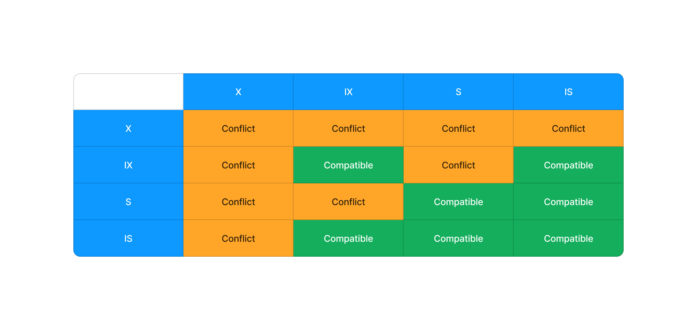
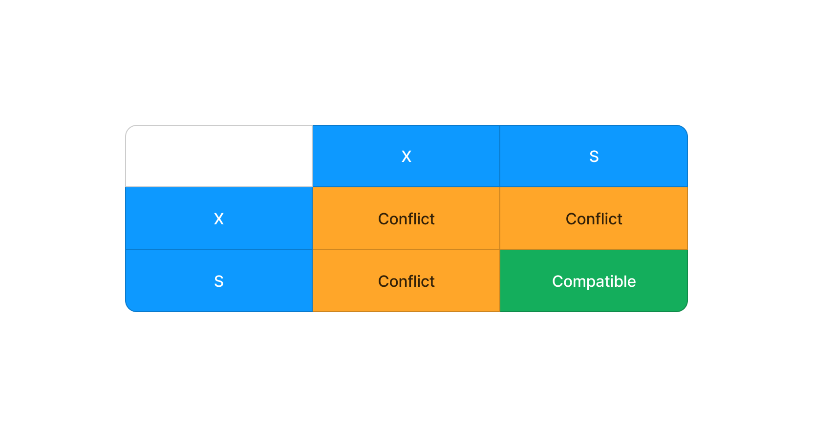
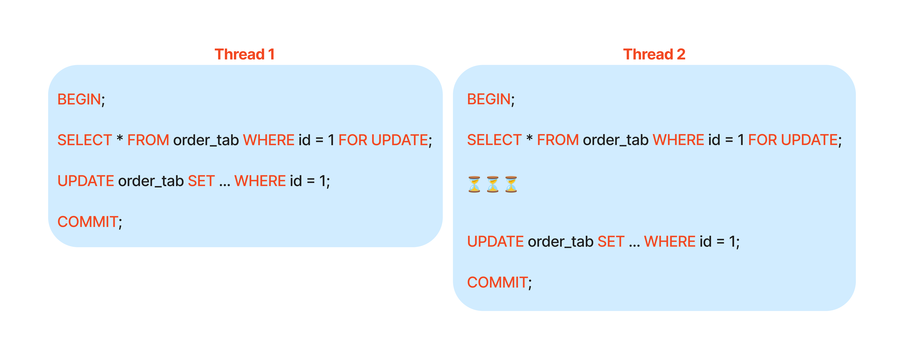

## Introduction

When I ask other developers "how to prevent race conditions in MySQL", Many
people propose setting the isolation level to `Serializable` as a solution to
prevent race conditions in MySQL. This response suggests a common
misunderstanding between isolation levels and locking mechanisms.

While `Serializable` is the highest isolation level and may prevent race
conditions, relying solely on it may not always be the most efficient or
appropriate approach. In many cases, implementing proper locking mechanisms can
be a more effective and performant solution.

A deeper understanding of InnoDB locking mechanisms, including different lock
types and their compatibility, is essential for effectively addressing
concurrency issues in database systems.


## MySQL InnoDB Locking

The following is the definition of type of locks and the compatibility table
from [MySQL doc](https://dev.mysql.com/doc/refman/8.4/en/innodb-locking.html)

:::info
InnoDB implements standard row-level locking where there are two types of locks,
shared (S) locks and exclusive (X) locks.

- A shared (S) lock permits the transaction that holds the lock to read a row.
- An exclusive (X) lock permits the transaction that holds the lock to update or
  delete a row.

InnoDB supports multiple granularity locking which permits coexistence of row
locks and table locks. For example, a statement such as LOCK TABLES ... WRITE
takes an exclusive lock (an X lock) on the specified table. To make locking at
multiple granularity levels practical, InnoDB uses intention locks. Intention
locks are table-level locks that indicate which type of lock (shared or
exclusive) a transaction requires later for a row in a table. There are two
types of intention locks:

- An intention shared lock (IS) indicates that a transaction intends to set a
  shared lock on individual rows in a table.
- An intention exclusive lock (IX) indicates that a transaction intends to set
  an exclusive lock on individual rows in a table.
:::



Many individuals find themselves overwhelmed by the variety of lock types
available. Understanding concepts like Intention Shared (IS) and Intention
Exclusive (IX) locks can be particularly challenging. These locks are primarily
used internally by MySQL for performance optimization and typically don't
require direct user intervention.

Therefore, for those new to InnoDB locking, I believe the compatibility table
below provides a more practical and accessible starting point for understanding
how different lock types interact



## How to acquire a lock

To explicitly acquire an X lock (exclusive lock) on a specific row, you can
utilize the `SELECT ... FOR UPDATE` statement. For instance, to obtain an X lock
on the order with an ID of 1, you would execute the following query:

```sql
SELECT * FROM order_tab WHERE id = 1 FOR UPDATE;
```

However, it's important to note that X locks can also be acquired implicitly
through other data modification operations, such as `UPDATE`, `DELETE`, and `INSERT
ON UPDATE` statements.

Similarly, you can acquire an S lock with the `SELECT ... LOCK IN SHARE MODE` query.
For instance, to obtain an S lock on the order with an ID of 1, you would execute the follow query

```sql
SELECT * FROM order_tab WHERE id = 1 LOCK IN SHARE MODE;
```

:::note
In the examples above, the lock is acquired for only one row because the id
column is the primary key. This aligns with the general rule of InnoDB locking:
it acquires locks on the specific rows that it needs to read. If there is no index
on the id column and MySQL has to do a table scan, it my block all of the rows of order_tab table
:::

## Example

In the below example, both `thread 1` and `thread 2` want to update the `order
1`. But `thread 2` need to wait for `thread 1` to finish its operation first
before `thread 2` can obtain the lock and start to execute its operations



## Outro

While seemingly simple, locking is a powerful mechanism for preventing race
conditions. I hope this blog post has provided you with a better understanding
of locking concepts. To delve deeper, I recommend exploring topics such as
deadlocks and troubleshooting locking-related issues
