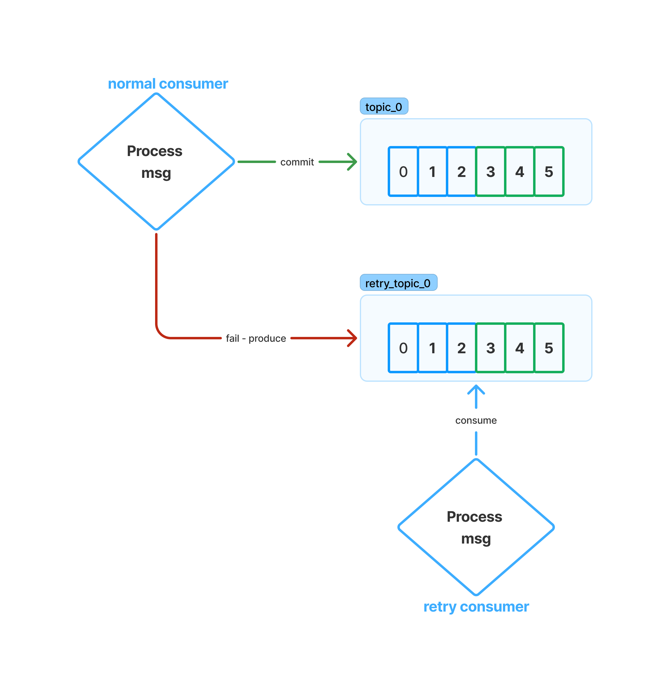

# Building a Resilient Kafka Consumer with Hot Retries, Cold Retries, and Dead Letter Queues

Kafka-powered systems must gracefully handle failures to avoid data loss or
pipeline blockage. This guide explains **hot retry**, **cold retry**, and **Dead
Letter Queue (DLQ)** patterns for Kafka consumers, showing how messages flow
through retries to a DLQ. We’ll cover design patterns and key implementation
considerations for a robust, observable retry mechanism.

## Introduction

In distributed microservices, transient errors (like timeouts or temporary
unavailability of a resource) are common. Rather than fail processing
permanently on first try, a **resilient Kafka consumer** should retry processing
events and only give up as a last resort.

* **Hot retries**: immediate, in-place retries of the message upon failure.
* **Cold retries**: delayed retries, often by offloading the message to a
  separate queue/topic for later processing.
* **Dead Letter Queues (DLQs)**: a final destination for messages that exhaust
  all retries or encounter unrecoverable errors.

Together, these patterns ensure that transient issues are overcome by retries (
hot or cold), and problematic messages don’t block the main stream – instead
they land in a DLQ for analysis. The following sections define each concept and
then dive into design and implementation.

## Hot Retry vs Cold Retry vs DLQ

### Hot Retry (Immediate Retries)

A **hot retry** means retrying the message consumption immediately upon failure,
in the same consumer context. The consumer simply attempts to process the
message again (usually a few quick attempts) without moving it to another queue.
For example, if a database call times out or a downstream service is momentarily
unreachable, a hot retry may succeed a second or two later. Hot retries handle
*short-lived, transient* errors that can resolve almost instantly. They are
performed synchronously or back-to-back in the consumer thread, before moving on
to the next message.

**Key characteristics:** Hot retries are fast. However, they temporarily block the
consumer’s partition until either the message succeeds or the max retry count is
reached. Use a small retry count to avoid long stalls. That said, in systems
that demand strong consistency, strict message ordering, and zero tolerance for
data loss, it’s common to see **infinite hot retries** applied. This ensures
that a message is not dropped or skipped under any circumstance, even at the
cost of availability or throughput.

### Cold Retry (Delayed Retries)

A **cold retry** refers to deferring the message for later processing, giving
the system time to recover from the underlying issue. This typically involves
producing the failed message to a retry topic with a delay, such as
`topic-retry-5min`, and consuming it later for reprocessing. This is ideal for
handling medium-term issues like downstream service outages or resource
exhaustion.

**Key characteristics:** Cold retries are asynchronous and non-blocking for the
main consumer. They allow the system to introduce backoff strategies and reduce
load pressure. However, they add complexity due to managing retry topics,
scheduling, and potential out-of-order message delivery.

### Dead Letter Queue (DLQ)

A **Dead Letter Queue** is the final destination for messages that cannot be
successfully processed after all retry attempts have been exhausted. These could
be due to irrecoverable errors such as malformed messages, unexpected payloads,
or logic bugs.

**Key characteristics:** The DLQ provides a safety net for problematic messages,
ensuring that the consumer pipeline continues processing other messages.
Messages in the DLQ can be monitored, inspected, and optionally reprocessed
later. Robust observability and alerting should be in place to address DLQ
entries proactively.

## Comparison Table

| Feature                   | Hot Retry                     | Cold Retry                         | Dead Letter Queue (DLQ)            |
|---------------------------|-------------------------------|------------------------------------|------------------------------------|
| Retry Location            | In-memory, same consumer loop | Retry topic, different consumer    | Separate topic for failed messages |
| Delay                     | None or minimal               | Configurable (e.g., 5min, 30min)   | No retries, terminal failure       |
| Use Case                  | Transient, short-lived errors | Medium-term recoverable issues     | Irrecoverable errors               |
| Impact on Consumer Thread | Blocking                      | Non-blocking                       | Non-blocking                       |
| Message Ordering          | Preserved                     | May be disrupted                   | Not applicable                     |
| Complexity                | Low                           | Medium to High                     | Low                                |
| Implementation Cost       | Simple logic in consumer      | Requires topic management & delays | Requires monitoring tools          |
| Example Failure Scenarios | Temporary DB/network glitch   | Dependency downtime                | Malformed payload, invalid schema  |

## Retry Handling in Apache Pulsar

Apache Pulsar, a distributed pub-sub messaging system, also provides built-in
mechanisms for message retries and dead letter topics, though its approach
differs from Kafka.

### Negative acknowledgement

The negative acknowledgement mechanism allows you to send a notification to the
broker indicating the consumer did not process a message. When a consumer fails
to consume a message and needs to re-consume it, the consumer sends a negative
acknowledgement (nack) to the broker, triggering the broker to redeliver this
message to the consumer.

### Retry Letter and Dead Letter Topic

Retry letter topic allows you to store the messages that failed to be consumed
and retry consuming them later. With this method, you can customize the interval
at which the messages are redelivered. Consumers on the original topic are
automatically subscribed to the retry letter topic as well. Once the maximum
number of retries has been reached, the unconsumed messages are moved to a dead
letter topic for manual processing. The functionality of a retry letter topic is
implemented by consumers.

## Conclusion

Resilience is a critical aspect of any message-driven system. Kafka’s lack of
native retry or DLQ mechanisms gives developers the flexibility. But also the
responsibility to build fault-tolerant systems tailored to their use cases. By
using a combination of **hot retry**, **cold retry**, and **DLQ**, you can
handle transient, long-term, and irrecoverable failures gracefully.

Understanding the trade-offs between retry approaches helps you balance
**consistency**, **throughput**, and **system complexity**. For teams looking
for built-in options, Apache Pulsar offers an alternative with integrated redelivery
and DLQ handling. Whatever the platform, a strong retry strategy combined with
observability ensures your consumers are not just functional, but
production-ready and resilient.