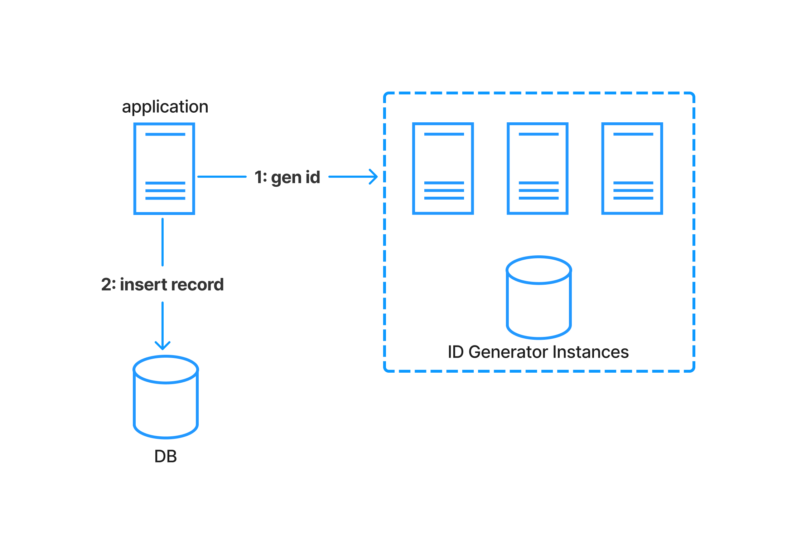
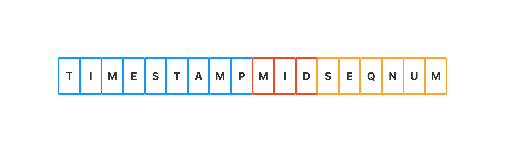
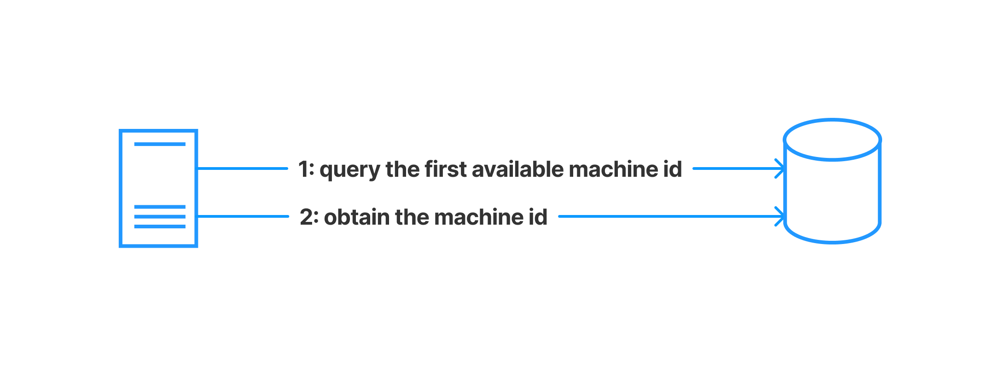
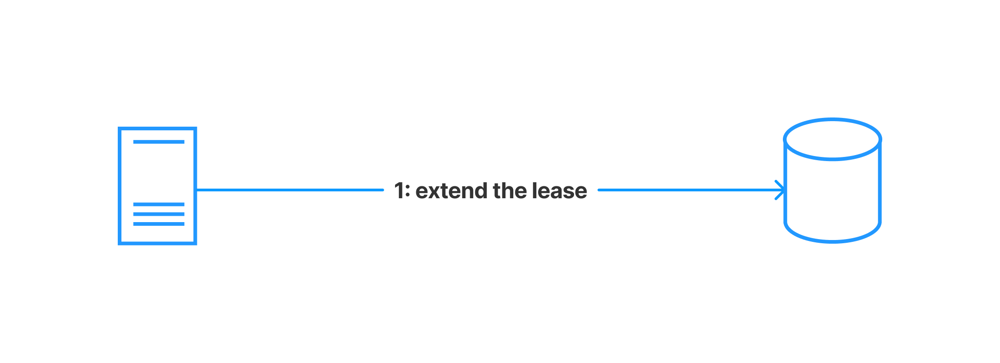

## Background

In modern distributed systems, where applications and data are spread across
multiple servers, generating unique and globally consistent identifiers becomes
crucial. This is where a distributed ID generator comes in.

Here are some key reasons why a distributed ID generator is needed:

**1. Scalability:** Traditional ID generation methods, like auto-incrementing
databases, struggle to scale horizontally. A distributed ID generator allows any
server to independently generate IDs, eliminating the need for a central
bottleneck. This enables a system to handle high volumes of requests and easily
add more servers as needed.

**2. High Availability:** Distributed ID generators typically don't have a
single point of failure. If one server goes down, others can continue generating
IDs without interruption. This ensures system uptime and data integrity,
especially in a critical environment.

**3. Efficiency:** Distributed ID generators can be designed to generate IDs
efficiently, minimizing CPU and network overhead. This helps maintain system
performance even under high loads.

**4. Security:** Some distributed ID generators offer features like random ID
generation or cryptographic hashing to enhance security and prevent potential ID
collisions or manipulation.

Here are some specific examples of how distributed ID generators are used:

- **Microservices**: Each microservice can generate its own IDs without relying
  on a central service, leading to a more loosely coupled and scalable
  architecture.
- **Event-driven systems**: Unique IDs are crucial for tracking events across
  different components of a distributed system.
- **Messaging systems**: Each message needs a unique ID for identification and
  routing.
- **Data pipelines**: Data items require unique IDs for proper tracking and
  processing across different stages of a pipeline.

In this Blog, I will present one of the way to implement a
distributed `ID Generator` based
on [Snowflake](https://en.wikipedia.org/wiki/Snowflake_ID)

## Design

### Architecture

In order to generate a new id, the `Business` application will need to call one
of the `ID Generator` instances. The `ID Generator` then will generate the id
and return in the response.

### ID Format

We can split the ID into 3 parts

- **Timestamp**: to optimize the space you may consider to not use UNIX epoch
  which is the number of seconds that have elapsed since 1970. And choose your
  own start date. i.e your development start from 2023, you can consider to 2023
  as the start date
- **Machine ID**: is the id of the `ID Generator`  instance which is assigned at
  the startup time. you should choose the number of slots for the `Machine ID`
  that shouldn't be too big because it will occupy the space of other parts. And
  shouldn't be too small because it will affect the number of instances of the
  id generator which in turn affect the scalability
- **Sequence Number**: used to avoid the collision of a new generated id at the
  same timestamp of the same `ID Generator` instance. you should give it enough
  space so the number of uniq sequence number of it generator instance can
  handle your max QPS

### Startup

During the startup of a `ID Generator` instance, it should obtain
the `Machine ID` before start to serve the traffics of the clients to generate
ids. One of the way to do this is to have a list of pre-defined `Machine ID` in
the DB. And the instance will try to get one available `Machine ID` with lock to
avoid race condition. Then obtain the `Machine ID` by updating the record in the
DB with the new owner is the current `ID Generator` instance, and new lease time
to avoid a dead instance to hold the `Machine ID` forever

### Heart Beat / Lease Extension

In order to avoid a dead instance hold the `Machine ID` forever, each instance
should set a lease time and extend it periodically. If it fail to extend the
lease, it should stop receiving the request to generate id because
the `Machine ID` may be obtained by another instance and can cause collision if
the instance keep serving the requests
