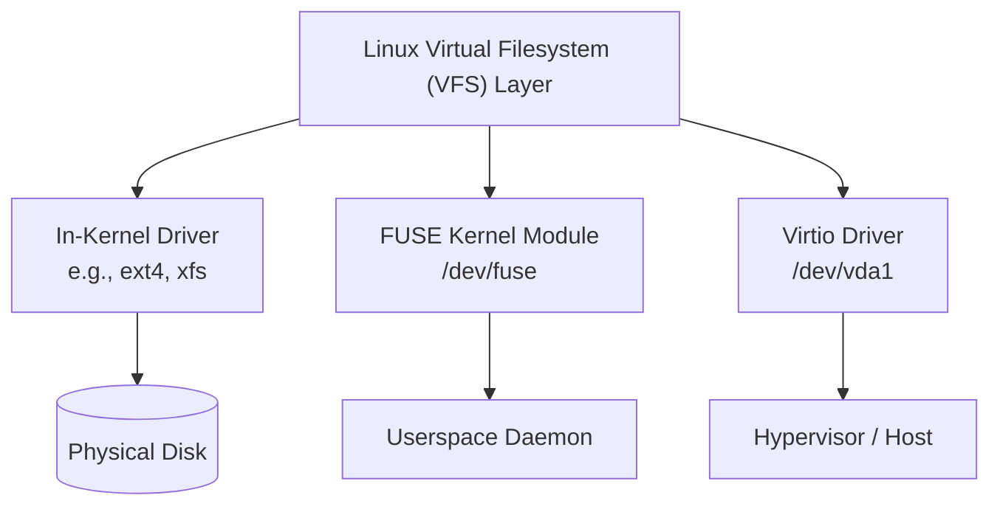
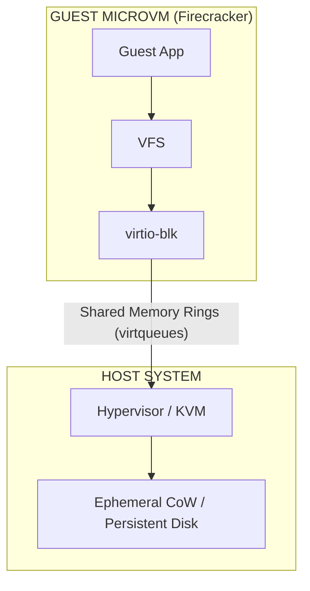
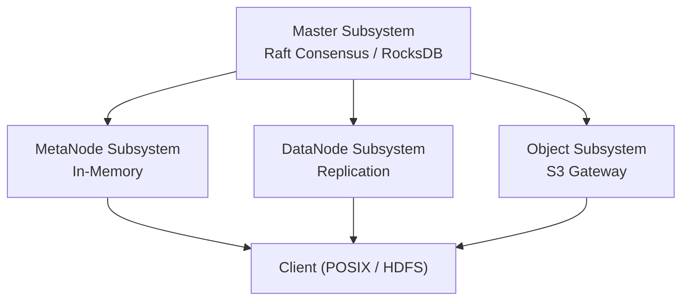
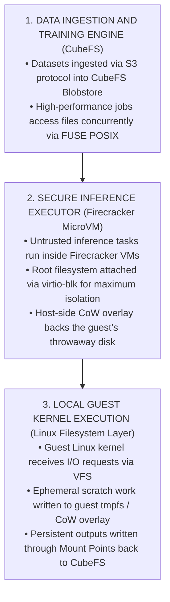

Storage in modern Linux infrastructure often feels like a sprawling maze. Systems engineers and developers encounter a bewildering stack of terms: POSIX, `fstab`, FUSE, block vs. file abstraction, virtio-fs, and distributed storage engines like CubeFS.

To build reliable systems, you cannot view these concepts in isolation. They form a continuous evolution—from raw kernel mount interfaces and userspace drivers to microVM isolation and container-native storage clusters.

This post breaks down the storage hierarchy step-by-step, explaining how Linux filesystems, FUSE, Firecracker microVMs, and CubeFS fit together.

<!-- truncate -->

## 1. The Foundation: Linux Filesystems, Mounting, and FUSE

Everything in Linux storage begins with the unified directory tree. Linux organizes all storage resources—whether local physical disks, userspace filesystems, or network mounts—under a single root directory (`/`).

### How Mounting Works Under the Hood

Mounting is the kernel process of attaching a filesystem structure to an existing empty directory (the **mount point**).

When you issue a `mount` command:

1. The kernel reads the superblock and inode structure of the target device or resource.
2. The Virtual Filesystem (VFS) layer binds the root inode of that resource to the target directory path (e.g., `/mnt/data`).
3. Standard Linux system calls (`open()`, `read()`, `write()`) are routed transparently through the VFS to the appropriate filesystem handler.

### In-Kernel Filesystems vs. FUSE (Filesystem in Userspace)

Storage systems interact with the VFS through two primary execution paths:

* **In-Kernel Filesystems (`ext4`, `xfs`, `btrfs`):**
The filesystem code executes directly inside kernel space. These drivers natively parse and store POSIX metadata (User ID, Group ID, permission bits) directly inside disk inodes. They deliver high performance, but adding or modifying a filesystem driver requires kernel-level code or modules.
* **FUSE (Filesystem in Userspace):**
FUSE allows developers to create full-featured filesystems in userspace without writing kernel code.
When an application makes a system call on a FUSE mount:
1. The VFS forwards the request to the `/dev/fuse` kernel module.
2. The kernel passes the request across the kernel-userspace boundary to a custom **FUSE Userspace Daemon**.
3. The daemon processes the request (e.g., fetching a block over HTTP, decrypting a stream, or interacting with a distributed database) and returns the data back through `/dev/fuse` to the VFS.

FUSE provides exceptional safety and flexibility—enabling encrypted filesystems (`gocryptfs`), cloud mounts (`rclone`, `sshfs`), and high-level storage clients—at the cost of context-switching overhead between kernel space and userspace.

That cost is not uniform, which is worth knowing before benchmarking one. Every request crosses the kernel-userspace boundary twice, so on large sequential reads and writes the crossing amortizes over a big payload and throughput stays respectable. It is metadata-heavy workloads that suffer: thousands of small `stat()`, `open()`, and `readdir()` calls turn into thousands of round trips, and the boundary crossing—not the backend—becomes the bottleneck.

## 2. Virtual Machine Storage: Firecracker MicroVMs (Persistent & Ephemeral)

While standard containers share the host Linux kernel, serverless and multi-tenant architectures (like AWS Lambda or Fly.io) use **MicroVMs** like **Firecracker** for hard hardware-level isolation.

Passing storage across a hypervisor boundary into a MicroVM requires specialized paravirtualization drivers, supporting both persistent and ephemeral storage lifecycles:

### A. Ephemeral vs. Persistent Lifecycles in MicroVMs

* **Ephemeral MicroVM Storage:** Highly common in serverless functions and short-lived execution environments. The host backs the guest's virtual disk with a Copy-on-Write (CoW) snapshot, temporary file, or `tmpfs` target on the host. Firecracker itself has no CoW layer—it requires a raw disk image—so the overlay comes from beneath it: an overlayfs or btrfs snapshot on the host, or a device-mapper thin volume. Whatever orchestrates the MicroVM discards that overlay at teardown, instantly wiping all runtime state.
* **Persistent MicroVM Storage:** Used for long-running stateful MicroVMs. The host backs the device with a permanent block device or network volume (such as local NVMe partitions, Ceph block devices, or cloud persistent disks) that survives guest reboots and teardowns.

### B. Paravirtualized Drivers: Block-Level vs. File-Level

* **Block Level (`virtio-blk`):**
Exposes a raw, virtualized block device (`/dev/vda`) to the guest VM. The guest kernel formats the device with its own filesystem (`ext4`) and manages layout locally. It can be backed by either an ephemeral CoW snapshot or a persistent host block image.
* **File Level (`virtio-fs`):**
Shares a directory tree directly between the host and guest, so there is no guest block device to format. The wire protocol is FUSE, with virtqueues replacing `/dev/fuse` as the transport. An optional **DAX** (Direct Access) window can map file contents into the guest's address space to skip the data copy entirely; the metadata path still travels the virtqueues either way. Can expose a host ephemeral directory or a shared persistent host directory.

One caveat that generic microVM material tends to gloss over: **Firecracker implements `virtio-blk` only.** There is no virtio-fs device, and that is a design decision rather than a gap—the entire premise is a minimal device model, because every device is attack surface. If you need virtio-fs, you need QEMU or Cloud Hypervisor.

## 3. Distributed Storage at Scale: Enter CubeFS

When scaling infrastructure and microVMs across thousands of physical servers, traditional single-node block devices or legacy network storage face performance, metadata, and multi-protocol barriers.

**CubeFS** is a CNCF incubating distributed cloud-native storage engine built specifically to address storage-compute separation for big data analytics, AI model training, and container workloads.

### How CubeFS Leverages FUSE and Distributed Infrastructure

1. **POSIX via FUSE Client:** CubeFS provides POSIX file system access to client nodes by running a specialized FUSE client daemon. When applications read or write files, the request hits VFS, routes to `/dev/fuse`, and is handled by the CubeFS client daemon to fetch or store chunk data across the distributed cluster.
2. **Multi-Protocol Interoperability:** Identical underlying data can be accessed interchangeably via **POSIX** (FUSE client), **AWS S3-compatible API**, and **HDFS** interfaces.
3. **Decoupled Architecture:**
* **MetaNode Subsystem:** Stores metadata (`inodes` and `dentries`) in memory using optimized B-Trees to handle millions of small file lookups per second.
* **DataNode Subsystem:** Stores actual payload bytes using dual engines: a high-performance **Replica Subsystem** for low-latency writes, and an **Erasure Coding Subsystem (Blobstore)** for cost-effective cold storage.

## 4. Synthesis: Putting the Entire Architectural Stack Together

To visualize how all these components intersect, consider an enterprise machine learning pipeline running inside isolated microVM environments:

### Summary Comparison Table

| Architecture Level | Primary Function | Key Technical Drivers | Lifecycle Boundary |
| --- | --- | --- | --- |
| **Linux VFS & Mounts** | Maps storage resources and drivers to a unified `/` path | `mount`, `fstab`, POSIX permissions | System Boot / Reboot |
| **FUSE (Userspace Storage)** | Enables userspace applications to serve as Linux filesystems | `/dev/fuse`, kernel-to-userspace IPC | Daemon Runtime |
| **MicroVM Storage** | Translates hypervisor storage into guest OS interfaces (ephemeral CoW or persistent) | `virtio-blk` (Firecracker's only block option), `virtio-fs` (QEMU, Cloud Hypervisor) | MicroVM Instance / Session |
| **CubeFS** | Scales distributed, multi-protocol storage for large-scale compute | MetaNodes (in-memory), DataNodes (Raft/EC), FUSE | Infrastructure / Cluster |
