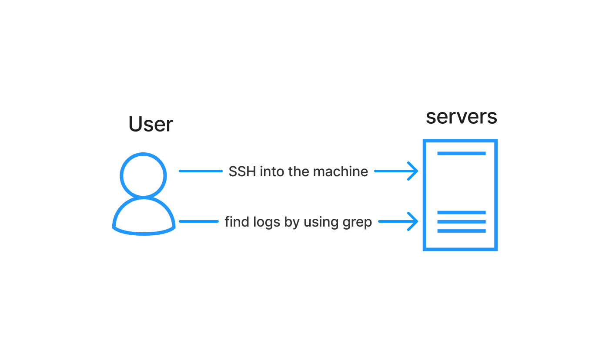
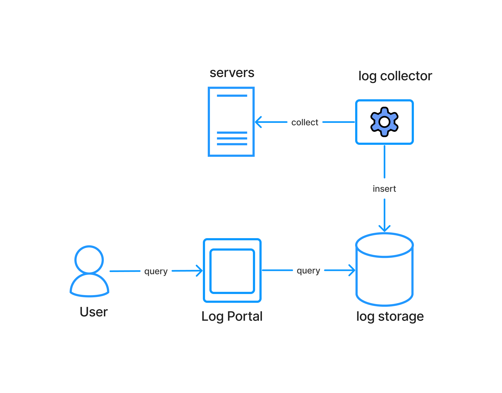
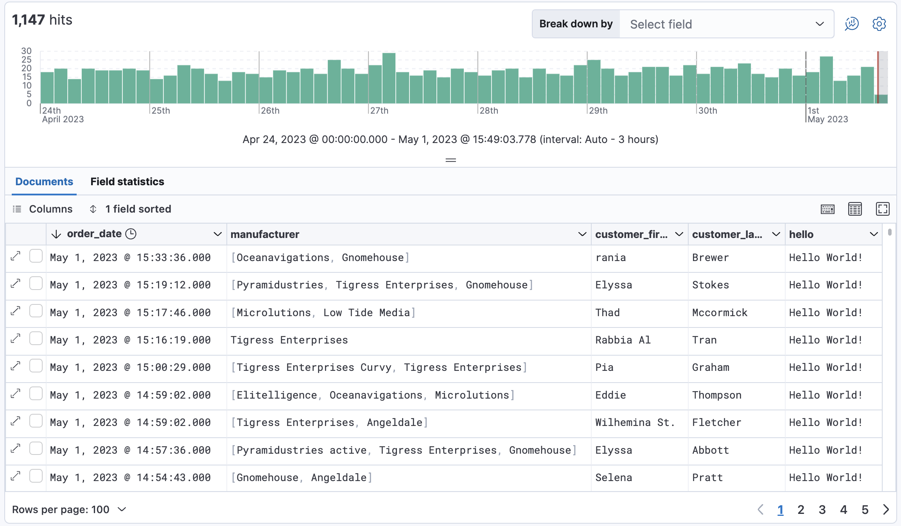
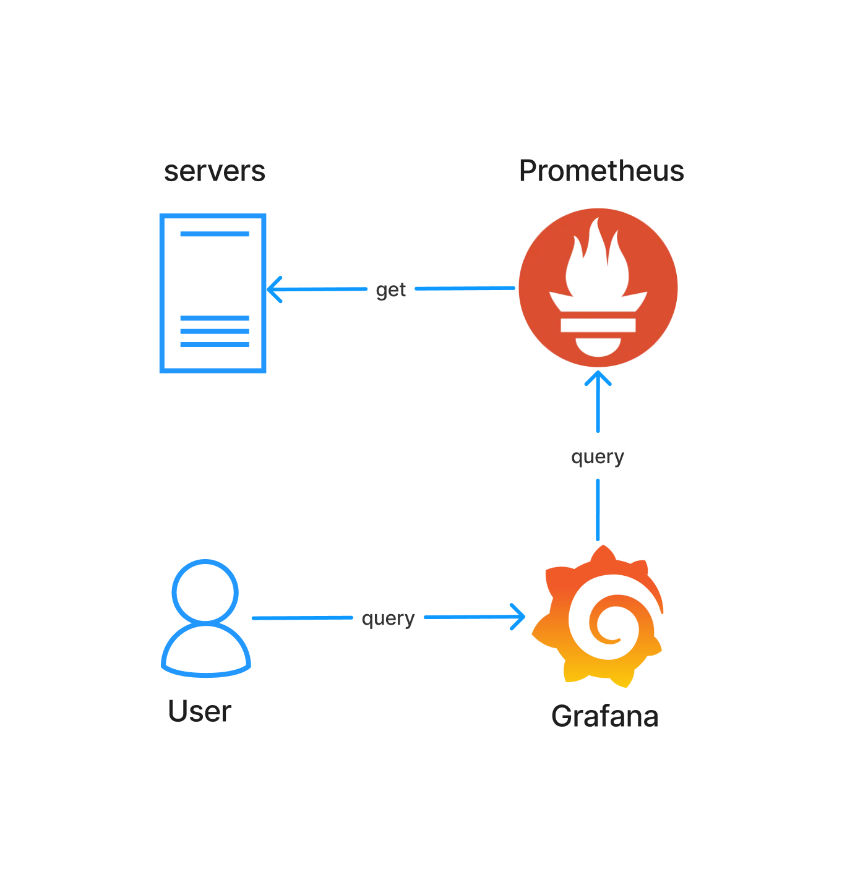
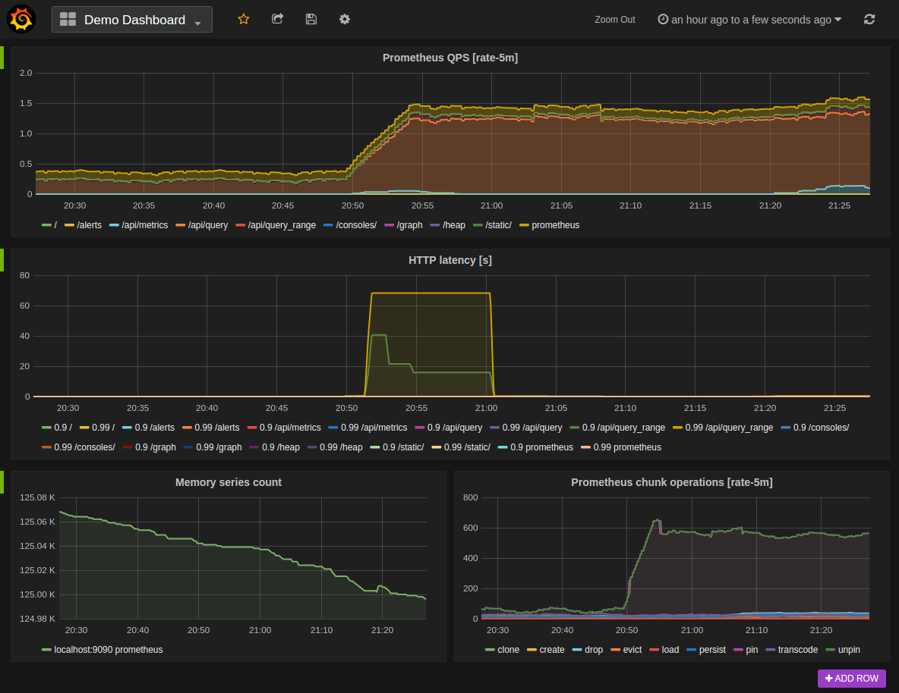
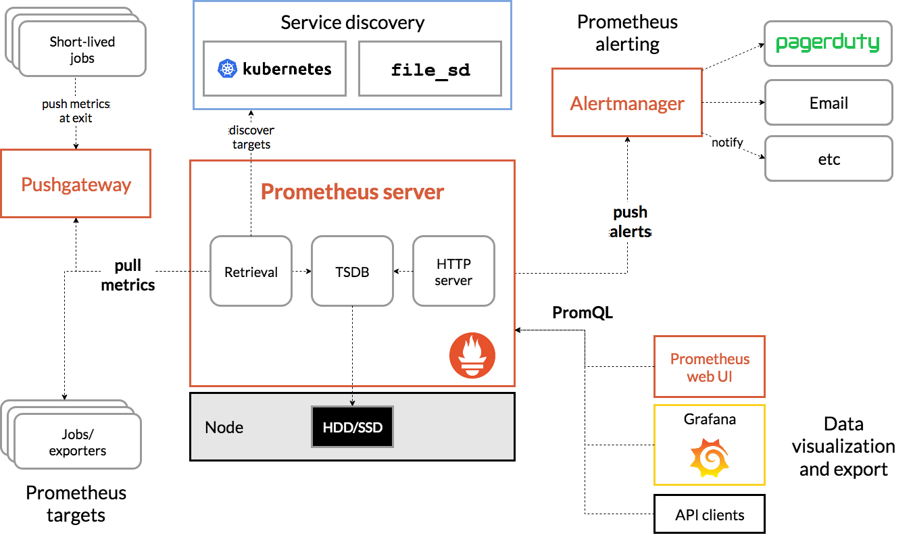
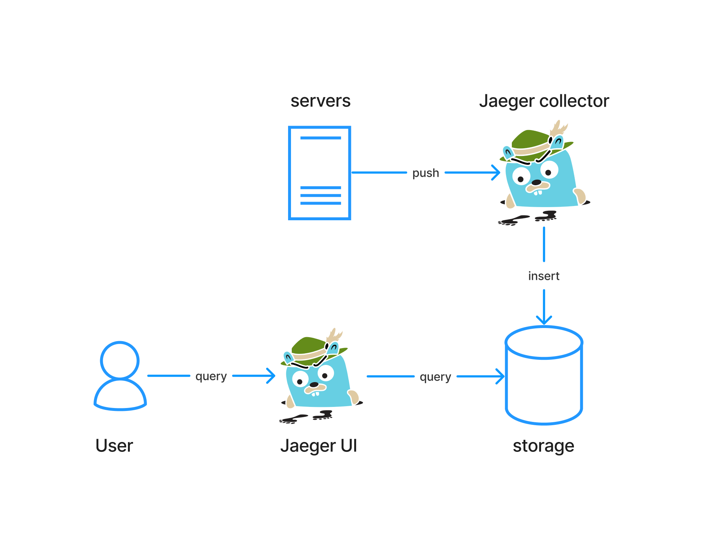
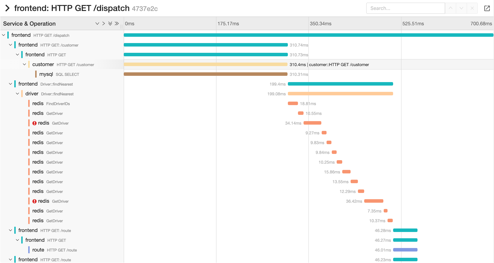

## Introduction

In the realm of computer science, particularly when it comes to understanding
complex systems, we rely on the concept of observability. It essentially boils
down to gaining a deep understanding of a system's internal state by examining
the data it generates externally. This is achieved through the three pillars of
observability: **Logs**, **Metrics**, and **Traces**.

The true power lies in using all three pillars together. Logs provide the
intricate details, metrics offer a performance overview, and traces map out the
By combining this data, you gain a comprehensive understanding
of your system's inner workings, enabling you to diagnose problems faster,
optimize performance, and ensure the overall health and reliability of your
system.

In this blog, I'm not going to describe the definition of these three pillars
again.
But rather tell about my experiences when I'm working with these three pillars

:::info
The introduction is written with the help
of [Gemini](https://gemini.google.com/)
:::

## Logs

In my experience working with various companies, I've encountered several
logging approaches. However, these can be broadly categorized into two main
methods: writing logs to files and utilizing a dedicated logging system. The
latter offers centralized management and analysis through a log collector, log
storage, and a log search portal, making it a more robust solution. In the
following sections, we'll delve deeper into these two approaches.

### Approach 1: Writing Logs To Files

The simplest approach involves writing logs directly to files. These log
messages are plain text containing essential information like timestamps, error
messages, and caller details. While this method is straightforward, it becomes
cumbersome when managing numerous servers. Manually `SSH` into each server to
grep logs is time-consuming and prone to errors. Additionally, poorly optimized
grep commands can inadvertently consume significant server resources, impacting
service performance

Another challenge arises from the limited storage capacity of `SSD` typically
used in high-traffic servers. These drives prioritize speed over space, often
only accommodating logs for a few days.  A common solution involves backing up
log files to servers with larger, slower storage options like `RAID`
configurations. While this allows developers to access historical logs, the
retrieval process can be frustratingly slow due to the inherent limitations of
these backup systems.

### Approach 2: Utilizing A Dedicated Logging Sytem


This approach utilizes a centralized architecture with distinct components for
log collection, storage, and log portal. Log collectors continuously monitor and
gather logs from files. These collected logs are then deposited
in a dedicated log storage solution, which is typically a database or search
engine. A log portal acts as the interface for querying and analyzing these
stored logs. Here are some key takeaways:

- **Structured Logging**: Similar to approach 1, you can write plain text logs.
However, consider using structured formats like `JSON` or delimited fields
(i.e separated by `|`) to enhance indexing and searchability within the log
storage.
- **Deployment Challenges**: When your company utilizes diverse deployment methods
(physical machines, Kubernetes, VMs, Docker), ensure your log collector is
compatible with all these environments for seamless log gathering.
- **Log Storage Considerations**: While optimized for reads and searches, log
storage write speeds might be slower. Avoid overwhelming the storage by
regulating the volume and frequency of written log data.
- **User-Friendly Log Portal**: Log storage query languages can be complex. The log
portal should offer a user-friendly alternative query language to simplify log
searches for users.


<center>The above image is an example of log portal (source
<a href="https://www.elastic.co/guide/en/kibana/current/discover.html"> Kibana)</a></center>


<br></br>

:::info
There are many way to set up a log system. But in this blog, I only
describe one of the most simple set up
:::

## Metrics



In my experience, [Prometheus](https://prometheus.io/) has emerged as my
preferred tool for monitoring applications. While I've explored various
solutions like [Graphite](https://graphiteapp.org/) and [New
Relic](https://newrelic.com/), [Prometheus](https://prometheus.io/)'
capabilities have impressed me the most. To set up metrics collection with
Prometheus and visualization with [Grafana](https://grafana.com/), here's what you'll need:

- **Application Metrics Endpoint**: Your application needs to expose a `/metrics`
endpoint so Prometheus can pull data directly.
- **Prometheus Data Collection**: Prometheus will scrape this endpoint periodically,
retrieving the metrics data from your application and storing it in its internal
database.
- **Grafana Visualization**: Users can then leverage Grafana to query and visualize
the collected metrics data stored by Prometheus, allowing for effective
monitoring and performance analysis.


While Prometheus boasts impressive performance, sustained use can lead to
occasional performance bottlenecks. Fortunately, similar to relational
databases, optimizing Prometheus often involves reducing the amount of data
queried. In the context of Prometheus, this translates to minimizing the number
of time series you query.

Here are some strategies to consider:

- **Leverage Recording Rules**: Utilize [recording
rules](https://prometheus.io/docs/prometheus/latest/configuration/recording_rules/)
to pre-calculate frequently used or computationally intensive expressions. This
reduces the workload on Prometheus during real-time queries.
- **Label Cardinality Management**: Be mindful when adding [labels](https://prometheus.io/docs/practices/naming/#labels) to your metrics.
Granular labels, while providing detailed information, can significantly impact
query performance. Aim for a balance between detail and manageability.
- **Optimize Query Time Range**: Whenever possible, reduce the time range of your
queries and focus on analyzing data for shorter periods. This reduces the amount
of data Prometheus needs to process for each query.


<center>The above image is an example of Grafana portal (source
<a href="https://prometheus.io/docs/visualization/grafana/"> Prometheus)</a></center>


<br></br>

:::info
In the above, I only mention one of the way to set up Prometheus by using pull
architecture. But you can also use push architecture by writing data to
Prometheus push gateway which is useful for short-lived applications

:::
## Traces

I first heard about tracing in 2019 from one of my friend when his company included
`trace_id` in the logs to help finding the logs of the requests faster. I
was already impressed about that idea. Later when I knew about distributed
tracing, it blew my mind away

### Approach 1: Log Trace Id

Imagine there is a user report an issue of their transaction with you. If
you're lucky you can find the logs by their `user_id`, or `transaction_id`. But
sometimes it's more complicated than that because user may make multiple
requests. Hence, it may have a lot of logs related to their `user_id`, and
`transaction_id` or sometimes you miss the important logs because the logs don't
contain `user_id` or `transaction_id` at all. And it's even more complicated if
your system is a microservices system where the number of logs for a single user
request can be a lot more than usual

So one of the solution is one of your gateway can generate a `trace_id` for each user request.
This `trace_id` is then propagated through all downstream microservices, ensuring
all related logs contain the `trace_id`. This allows you to efficiently
trace a user's entire transaction journey across your system, pinpointing the
root cause of issues swiftly.

:::info
```
           TRACE ID         SPAN ID           PARENT ID
SERVICE M  e4bbb7c0f6a2ff07.a5f47e9fced314a2:694eb2f05b8fd7d1
```

The above is one of the example of the trace id (source
[twitter](https://twitter.github.io/finagle/docs/com/twitter/finagle/tracing/TraceId.html))
:::

### Approach 2: Distributed Tracing System



`Jaeger` is the only distributed tracing system I've used directly, its
setup is straightforward. Applications typically push data to a `Jaeger
Collector`, which then stores it in a [supported
DBs](https://www.jaegertracing.io/docs/1.57/features/#multiple-storage-backends). Users can then query
these traces through the `Jaeger UI`

`Jaeger` provides valuable insights into your system's overall health and
performance. However, achieving maximum benefit can require additional effort.
Many libraries, such as database clients, Redis clients, and Kafka clients, may
not have built-in tracing support. Additionally, deploying Jaeger in production
environments requires careful consideration, as it can impact application
performance if not properly configured.


<center>The above image is an example of Grafana portal (source
<a href="https://www.jaegertracing.io/docs/next-release/frontend-ui/"> Jaeger)</a></center>


<br></br>

:::info
There are many ways to deploy and use Jaeger. You can refer to their [official
docs](https://www.jaegertracing.io/docs/1.57/architecture/)
:::
