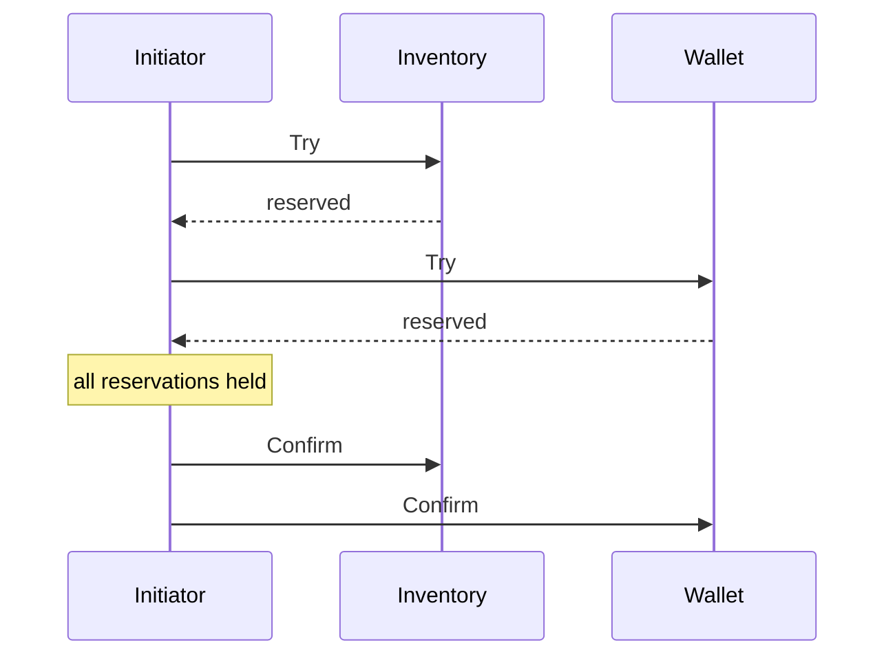
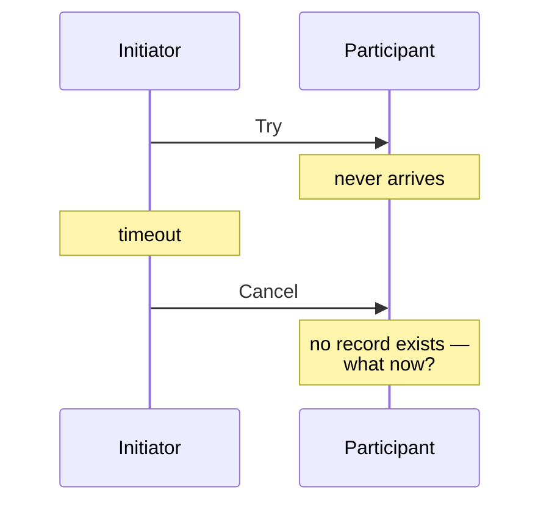
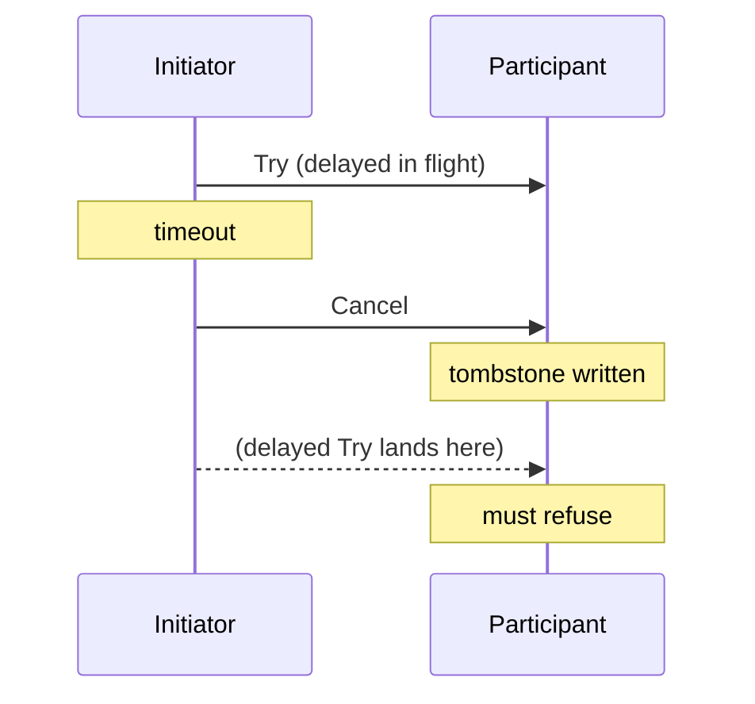
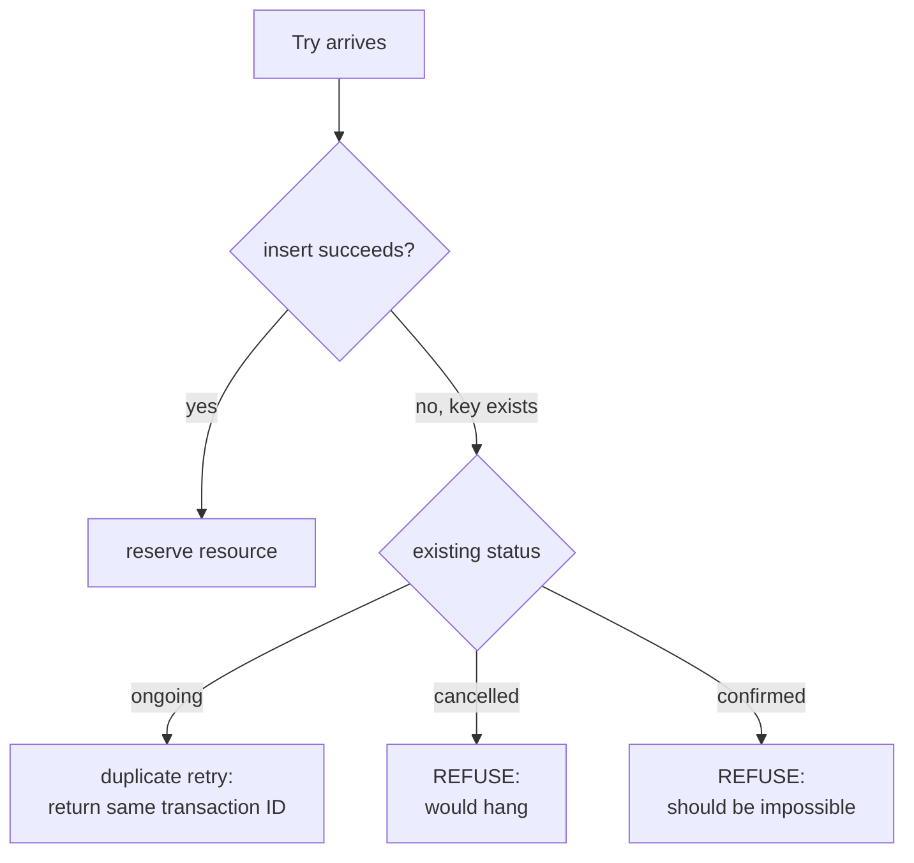
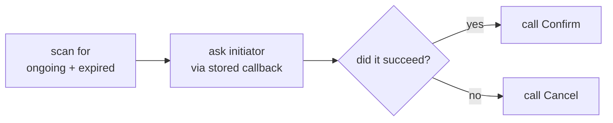

Splitting a monolith into services splits its database too. The moment that
happens, an operation that used to be one `BEGIN … COMMIT` becomes several calls
to several services, each with its own database, and no shared transaction to hold
them together.

Placing an order might need to reserve inventory, reserve a promotional voucher,
and charge a wallet. Three services, three databases. Any of them can fail, and
the ones that already succeeded do not know about it.

**Try / Confirm / Cancel** (TCC) is one of the better answers to this. It is not
complicated in principle — the interesting part is the handful of failure modes
that will silently corrupt your data if you implement the principle naively. This
post covers the pattern, the three classic hazards, and the operational machinery
that TCC needs to actually work in production.

## Why not just use a database distributed transaction?

The textbook answer is two-phase commit (2PC / XA), and it is worth understanding
why it is rarely the answer here.

- **Locks are held for the whole transaction.** In 2PC the database keeps rows
  locked from prepare until commit — across network round trips to other services.
  On any contended row that is fatal.
- **Every participant must speak the protocol.** Your payment provider's HTTP API
  does not support XA, and never will.
- **Coordinator failure blocks participants.** A participant that has prepared
  cannot unilaterally decide; it waits, holding its locks.
- **It does not compose with service boundaries.** Services deliberately hide their
  storage. 2PC requires reaching into it.

TCC moves the same idea up one layer: **instead of holding database locks, you hold
a business-level reservation.** The database transaction commits immediately at the
end of each phase, so nothing is locked while the network is slow.

## The pattern

Every participating service exposes three operations instead of one:

| Phase | Responsibility |
| --- | --- |
| **Try** | Check feasibility and *reserve* the resource. Nothing is final. |
| **Confirm** | The overall operation succeeded — make the reservation permanent. |
| **Cancel** | Something failed — release the reservation. |

An initiator (the service that owns the overall operation) calls Try on all
participants, then either Confirm on all of them or Cancel on all of them.



If the Wallet's Try fails, the Initiator calls Cancel on Inventory and the
reservation is released. No lock was ever held across a network call.

The direction of the "reserve" varies by operation, which trips people up. Two
examples of the same participant:

- **Deducting stock when placing an order** — Try deducts immediately (that *is*
  the reservation), Confirm just marks it final, Cancel gives the stock back.
- **Adding stock when cancelling an order** — Try reserves nothing visible, Confirm
  actually adds the stock, Cancel does nothing.

The rule: **Try must make the resource unavailable to anyone else, without making
the change visible as final.** How you achieve that depends on the direction of the
change.

## The transaction record

TCC needs one durable row per transaction per participant. What goes in it is the
whole design, so it is worth walking through:

| Field | Purpose |
| --- | --- |
| Reference ID | The initiator's own identifier for this operation |
| **Request hash** | Derived from reference ID + callback address (+ region). **Unique constraint.** |
| Confirm address | How to reach *this* participant's Confirm later |
| Cancel address | How to reach *this* participant's Cancel later |
| **Callback address** | How to ask *the initiator* whether the operation succeeded |
| Callback payload | What to send when asking |
| **Try payload** | The context needed to Confirm or Cancel later |
| Status | ongoing / confirmed / cancelled |
| Create time, expire time | When it started, when it should be considered abandoned |

Three of those deserve emphasis.

**The try payload makes the record self-contained.** Confirm arrives later, possibly
minutes later, possibly from a different caller than the one that ran Try. It carries
only a transaction ID. Everything needed to complete or compensate the business
change has to already be in the record — which amounts is being moved, for which
entity, in which direction. Get this wrong and Confirm cannot do its job.

**The callback address inverts recovery.** This is the field that homegrown
implementations usually omit, and it is the most important one. Storing *how to ask
the initiator about the outcome* means a stuck participant does not have to wait
passively to be told what happened. It can go and find out. More on this below.

**The request hash is the idempotency key**, enforced by a unique index rather than
by application code. Almost everything that follows is built on that constraint.

## Hazard 1: duplicate requests

Networks retry. Clients retry. A Confirm can arrive twice, and a Try can arrive
twice, and both must be safe.

The unique constraint on the request hash handles Try: the second insert fails,
you read the existing record, and respond based on its status. Confirm and Cancel
are guarded by a status check.

What matters is being **precise about which duplicate you are seeing**, because the
cases are not equally benign:

| Situation | Meaning |
| --- | --- |
| Try on an ongoing transaction | Harmless retry — return the existing transaction ID |
| Confirm on a confirmed transaction | Harmless retry |
| Cancel on a cancelled transaction | Harmless retry |
| **Confirm on a cancelled transaction** | **Bug or serious race — must not silently succeed** |
| **Cancel on a confirmed transaction** | **Bug or serious race — must not silently succeed** |
| **Try on a confirmed or cancelled transaction** | **Hazard 3, see below** |

Collapsing all of these into one "already processed" response is the mistake. The
first three are noise; the last three mean something is genuinely wrong and you want
to find out about it. Return distinguishable errors for each.

It is worth offering callers a choice here. Some want a duplicate Confirm to be an
error they can log; others just want it to be a no-op so they can retry blindly. An
opt-in "idempotent" mode that converts benign duplicates into success — while still
erroring on the dangerous transitions — serves both without weakening the model.

## Hazard 2: empty rollback

Here is the failure that breaks naive implementations.

The Initiator calls Try and times out. It does not know whether the participant got
the request, so it plays safe and calls Cancel. But the Try never arrived — the
packet was lost, or the participant crashed before writing anything.

**Cancel now arrives for a transaction that does not exist.**



The obvious implementation returns "transaction not found". That is wrong in a
subtle way: the Initiator cannot distinguish "nothing to cancel, we are fine" from
"your cancel failed, retry". It will either retry forever or move on while leaving
the outcome ambiguous.

The fix, usually called an **empty rollback** or empty cancel: **Cancel must
succeed by inserting an already-cancelled record.** A tombstone. There was nothing
to undo, so the business logic does nothing — but the record now exists, and the
Initiator gets a clean success.

## Hazard 3: the hanging transaction

Empty rollback creates a new problem, and this is where the design becomes elegant.

The lost Try was not lost. It was *slow*. It arrives after the Cancel.



If that late Try succeeds, it reserves a resource for a transaction the Initiator
has already given up on. Nobody will ever Confirm or Cancel it. The reservation
leaks permanently — a **hanging transaction**.

The fix comes free from the tombstone. The cancelled record already occupies the
unique key, so the late Try's insert collides, reads the existing record, sees
status `cancelled`, and refuses. One mechanism — unique key plus status check —
solves both hazards:



One detail that is easy to miss: you need to tell a tombstone apart from a normal
cancellation. A tombstone was created by Cancel with no preceding Try, so it has no
confirm or cancel address recorded — leaving those fields empty is enough to mark it.
That distinction matters, because a *second* Cancel arriving on a tombstone is a
different situation from a second Cancel on a genuinely-tried transaction, and you
want different errors for each.

## The part everyone forgets: completion is not guaranteed

Try succeeded. The reservation is held. Then the Initiator crashes, or its process
is killed mid-deploy, or its own database rolls back.

Confirm never comes. Cancel never comes. The reservation sits there forever.

**Nothing in the Try/Confirm/Cancel contract fixes this.** Without an answer, TCC is
not a protocol with a completion guarantee — it is a naming convention. The answer
is a background process that finds abandoned transactions and drives them to a
conclusion.

The mechanics are simple, which is why it is frustrating how often it is skipped:

```sql
-- with an index on (status, expire_time)
SELECT * FROM transactions
 WHERE status = 'ongoing' AND expire_time < now();
```

For each abandoned transaction, the sweeper uses the stored callback address to ask
the Initiator a single question: **did this operation succeed?**



The Initiator is the authority on the outcome, because it is the only party that
knows whether *all* participants succeeded. The participant cannot infer it, and a
timeout certainly does not imply failure. This is why the callback address had to be
stored back in Try: at recovery time, that row is the only thing that still exists.

Two ways to run it, and they suit different situations:

- **As a scheduled batch job** — simple, no service to operate, fine when your
  timeout is minutes and recovery latency does not matter much.
- **As a long-running service** — scans continuously and can also export metrics on
  what it sees, which you want if reservations are expensive to leave held.

## Operational design that pays off

The pattern is the easy part. These are the decisions that determine whether it is
pleasant to run.

### Make the transaction ID self-describing

The ID is the only thing Confirm receives. If it is an opaque random string you need
a global index to find the record — which becomes its own scaling problem.

Instead, **encode the locating information into the ID itself**: row identifier,
creation timestamp, shard index, region. Then encode the whole thing (base58 keeps it
compact and safe in URLs and logs). Now any holder of the ID can compute exactly
which shard, which table, and which row to read — no lookup index at all.

The creation timestamp is the quietly clever part. Combined with time-based table
sharding, it tells you which *table* the record lives in, which is otherwise
surprisingly hard to recover.

### Shard tables by time, not by hash

Transaction records are worthless once complete. They exist to survive a crash, and
after that they are audit trail at best.

Time-based tables — one per day or per month — mean cleanup is `DROP TABLE` rather
than a `DELETE` sweep chewing through a hot table. That single choice removes a whole
category of operational pain.

The tradeoff: the sweeper must now iterate a *range* of tables rather than querying
one, since abandoned transactions may sit in yesterday's table. Straightforward, but
you have to remember to do it.

### Archive before deleting

Keep completed records for a window, then move them to a separate archive database
and delete them from the live one, rate-limited so the archiving does not itself
become the load problem. Investigations happen days later; audits happen months
later; the hot table should carry neither.

### Monitor the age of held reservations

The single most useful signal is **how long transactions have been sitting in the
ongoing state**, bucketed by age. Track it as a gauge per bucket.

A healthy system shows almost nothing older than its timeout. A slow accumulation of
old ongoing transactions is the leading indicator that an initiator is failing to
finish what it started — usually visible well before anyone notices a business
symptom.

### Multi-region and multi-tenant

If you run per-region deployments, region has to be part of the identity: **in the
request hash**, so the same reference ID in two regions does not collide, and **in
the transaction ID**, so recovery routes the Confirm to the right place. The sweeper
then iterates per region and issues its callbacks with matching routing.

This detail is easy to add on day one and genuinely painful to retrofit, because
changing what feeds the request hash changes the identity of every in-flight
transaction. If there is any chance of going multi-region, put it in the hash now.

## When TCC is the wrong tool

It costs three endpoints per participant, a transaction table, a sweeper, and careful
reasoning about all three hazards. Do not pay that without needing it.

**Use a plain database transaction** if everything involved shares one database.
Nothing here beats `BEGIN … COMMIT`. If the difficulty is that a *single* resource is
heavily contended rather than that several services must agree, that is a different
problem with different answers — see
[The Contended Counter](/contended_counter).

**Just retry** if the operation is naturally idempotent and can be safely repeated
until it succeeds. Many operations that look like they need coordination only need a
retry and an idempotency key.

**Use events and eventual consistency** if intermediate inconsistency is acceptable.
Publishing a fact and letting consumers react is far less machinery, and for a great
many workflows "correct within a second" is entirely fine.

**Consider a saga** if you cannot express a reservation. A saga runs each step for
real and compensates by running an inverse step on failure. It needs no reserve
concept, which makes it applicable in more places — but intermediate states are
*visible* to everyone, so other readers can observe a half-completed operation. TCC's
reservation phase is what hides that, and the price is that every participant must
have something meaningful to reserve.

Reach for TCC when you need cross-service atomicity *and* isolation of intermediate
state *and* you control all participants. That is a real combination, but a narrower
one than it first appears.

## Takeaways

1. **TCC is 2PC moved up a layer** — business reservations instead of database locks,
   so nothing is held while the network is slow.
2. **The record must be self-contained.** Confirm arrives later with only an ID.
   Everything needed to finish or undo the work has to be stored at Try time.
3. **One unique constraint does most of the work.** Idempotency, empty rollback, and
   hanging-transaction prevention all fall out of a unique key plus a status check.
4. **Cancel must succeed even when there is nothing to cancel.** Write a tombstone.
5. **A late Try must be refused.** The tombstone is what makes that possible.
6. **Distinguish your duplicates.** Retried Confirm is noise; Confirm-after-Cancel is
   an incident. Do not return the same thing for both.
7. **Without a sweeper you do not have a protocol.** Something has to find abandoned
   transactions and ask the initiator how they ended.
8. **Encode location into the transaction ID.** It removes the need for a global
   lookup index entirely.
9. **Shard by time so cleanup is a `DROP`.**
10. **Watch the age of held reservations.** It is the earliest signal that an
    initiator is abandoning work.

The pattern itself takes an afternoon to understand. The three hazards and the
sweeper are what separate a TCC implementation that works from one that quietly
leaks reservations for a year before anyone notices.
