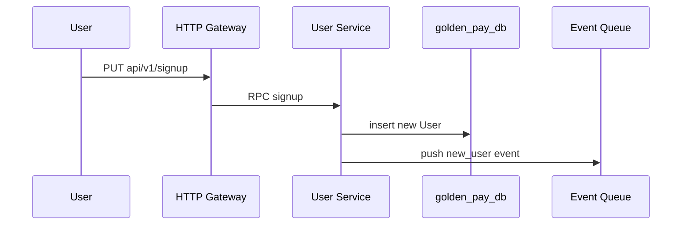
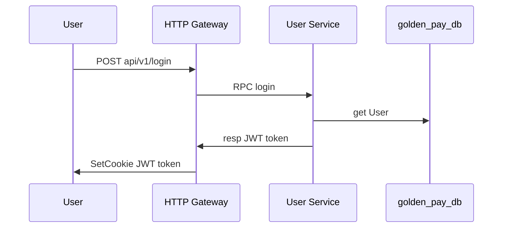
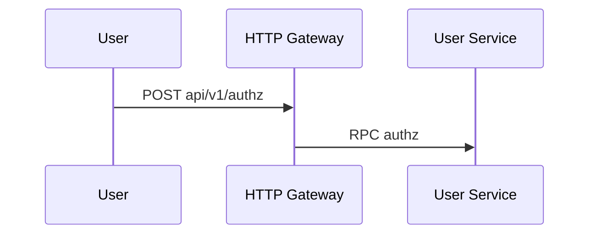
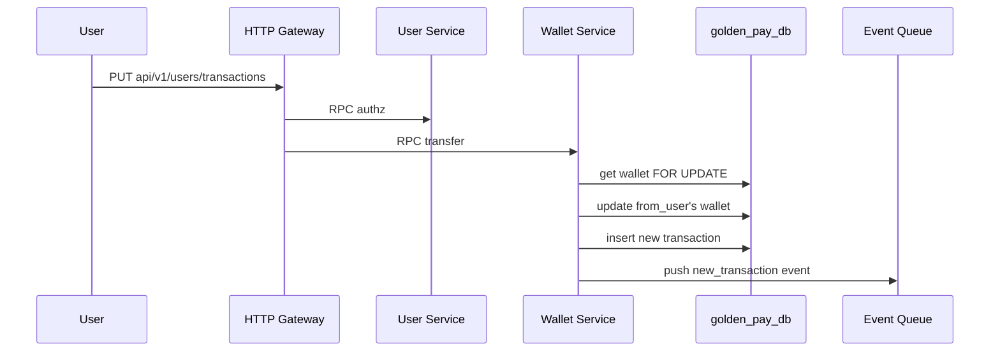
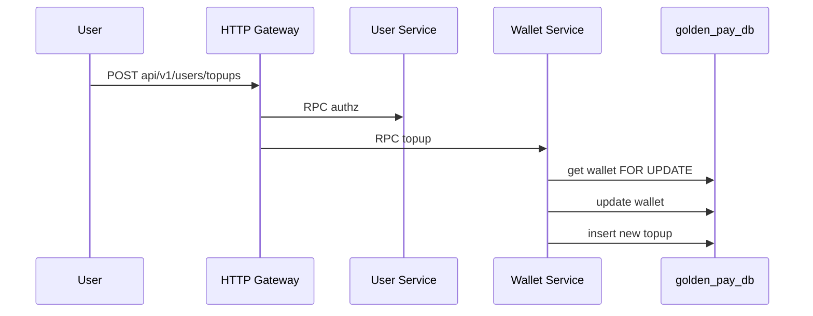
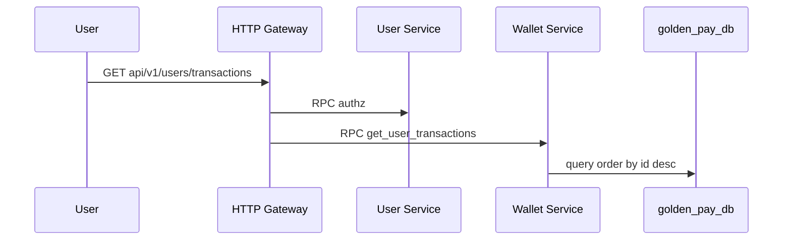
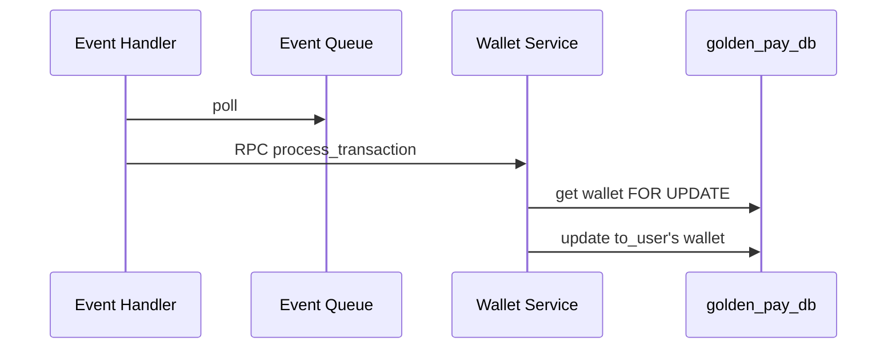
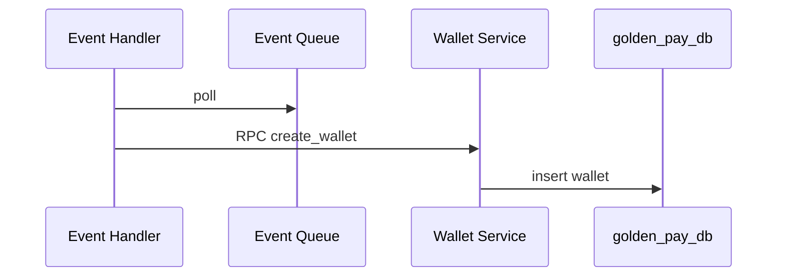

# v1.0.0 MVP

Implemented the MVP version that has the most important features

- `tag:` v1.0.0
- `date:` 2023-12-14

## HTTP Gateway

Implemented HTTP Gateway server that use [GIN](https://github.com/gin-gonic/gin)
to handle RESTFul APIs

- [POST api/v1/signup](#post-apiv1signup)
- [POST api/v1/login](#post-apiv1login)
- [POST api/v1/authz](#post-apiv1authz)
- [PUT api/v1/users/transactions](#put-apiv1userstransactions)
- [PUT api/v1/users/topups](#put-apiv1userstopups)
- [POST api/v1/users/transactions/_query](#post-apiv1userstransactions_query)
- [GET api/v1/users/wallets](#get-apiv1userswallets)

### POST api/v1/signup

#### Request

```yaml
email:
  type: string
password:
  type: string
name:
  type: string
```

#### Response

```yaml
# type Response
code:
  type: common.Code

# type common.Code
id:
  type: uint32
msg:
  type: string
```

### POST api/v1/login

#### Request

```yaml
email:
  type: string
password:
  type: string
```

#### Response

```yaml
code:
  type: common.Code
```

### POST api/v1/authz

#### Request

```yaml
# empty object
```

#### Response

```yaml
code:
  type: common.Code
```

### PUT api/v1/users/transactions

#### Request

```yaml
to_email:
  type: string
amount:
  type: int64
```

#### Response

```yaml
code:
  type: common.Code
```

### PUT api/v1/users/topups

#### Request

```yaml
amount:
  type: int64
```

#### Response

```yaml
code:
  type: common.Code
```

### POST api/v1/users/transactions/_query

#### Request

```yaml
# type Request
pagination:
  type: Pagination

# type Pagination
val:
  type: int64
  remark: cursor value
imit:
  type: uint32
  remark: cursor value
as_more:
  type: bool
  remark: the server will not check this value of a request.
    But client should use this to check if need to send another request to query more data
```

#### Response

```yaml
# type Response
code:
  type: common.Code
data:
  type: GetUserTransactionsData

# type GetUserTransactionsData
transactions:
  type: [ ]Transaction
next_pagination:
  type: Pagination

# type Transaction
id:
  type: uint64
from:
  type: User
to:
  type: User
amount:
  type: int64
status:
  type: uint32
ctime:
  type: uint64

# type User
id:
  type: uint64
name:
  type: string
email:
  type: string
```

### GET api/v1/users/wallets

#### Request

```yaml
# Empty request
```

#### Response

```yaml
# type Response
code:
  type: common.Code
data:
  type: GetUserWalletData

# type GetUserWalletData
balance:
  type: int64
```

## User service

Implemented the [gRPC](https://grpc.io/) service that handle the following
features

- Signup
- Login
- Authorization
- Get User's info

### Signup



### Login



### Authorization



## Wallet service

Implemented the [gRPC](https://grpc.io/) service that handle the following
features

- Transfer
- Topup
- Get user's transactions
- Process Transfer
- Create wallet

### Transfer



### Topup



### Get user's transactions



### Process Transaction



### Create Wallet



## Event handler

- Listen to `new_user` event to create user's wallet
- Listen to `new_transaction` event to verify and process a transaction to move
  it from `pending` to `success` or `rejected`